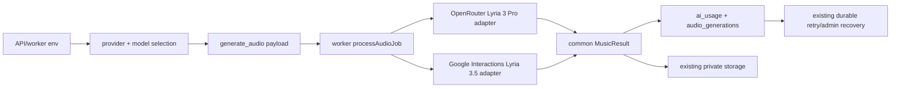

# Google Lyria 3.5 Integration Design

**Spec**: `.specs/features/google-lyria-integration/spec.md`
**Status**: Implemented; live technical evidence captured; human listening pending

## Architecture Overview

The worker keeps one internal `MusicProvider` seam. OpenRouter remains the default and current provider; Google Lyria 3.5 is a second adapter selected by server-side configuration. New audio jobs snapshot the provider/model in their JSON payload. Jobs created before this feature have no selection and continue to mean OpenRouter.



The Google adapter is synchronous for this slice because the current Interactions documentation shows the completed audio in the create response. No operation table or second queue is introduced. If the live response contradicts that contract, the comparison stops and the mismatch is documented rather than guessed around.

## Code Reuse Analysis

### Existing Components to Leverage

| Component                                   | Location                                                       | How to Use                                                                                           |
| ------------------------------------------- | -------------------------------------------------------------- | ---------------------------------------------------------------------------------------------------- |
| Audio provider seam and container detection | `apps/worker/src/worker.ts:110-453`                            | Add provider metadata and the Google request/response parser beside the existing OpenRouter adapter. |
| Durable job claim/retry                     | `apps/worker/src/worker.ts:1096-1152`                          | Keep PostgreSQL claim, terminal classification and retry transitions unchanged.                      |
| Audio persistence and private storage       | `apps/worker/src/worker.ts:675-817`                            | Replace fixed provider/model values with resolved job selection; keep asset and order transitions.   |
| Generic usage ledger                        | `packages/database/src/schema.ts:184-213`                      | Reuse existing provider/model/cost/error columns; no migration.                                      |
| Environment validation                      | `apps/api/src/env.ts:12-78`                                    | Add Google selection/key/model validation while preserving OpenRouter defaults.                      |
| Local preview launcher                      | `scripts/local-preview.sh:1-70`                                | Load only the selected server-side key/model for API/worker; keep web credential-free.               |
| Admin audio recovery                        | `apps/api/src/app.ts:2115-2166` and `apps/api/src/recovery.ts` | Preserve the job payload on retries and snapshot a safe provider/model for replacements.             |

### Integration Points

| System            | Integration Method                                                                                                        |
| ----------------- | ------------------------------------------------------------------------------------------------------------------------- |
| Google Gemini API | `POST https://generativelanguage.googleapis.com/v1beta/interactions`, `x-goog-api-key`, JSON prompt/model, `store:false`. |
| OpenRouter        | Existing streaming chat-completions adapter, unchanged transport and default.                                             |
| PostgreSQL        | Existing `generation_jobs.payload`, `audio_generations`, and `ai_usage`; no schema change.                                |
| Browser preview   | Existing web/API endpoints; smoke only, no generation click without a verified budget.                                    |

## Components

### Provider selection and configuration

- **Purpose**: Validate and resolve `openrouter` or `google` without putting credentials in jobs or the browser.
- **Location**: `apps/api/src/env.ts`, `apps/worker/src/worker.ts`, `.env.example`, `scripts/local-preview.sh`.
- **Interfaces**:
  - `MUSIC_PROVIDER: 'openrouter' | 'google'` - selected audio supplier, defaulting to OpenRouter.
  - `GOOGLE_MUSIC_MODEL?: string` - model id, default `lyria-3.5`.
  - `WorkerConfig.musicProvider` / `musicModel` - resolved worker selection.
- **Dependencies**: existing dotenv/env loading.
- **Reuses**: current production validation and preview opt-in.

### Common music provider metadata

- **Purpose**: Carry provider/model alongside the existing `generate(prompt)` seam.
- **Location**: `apps/worker/src/worker.ts`.
- **Interfaces**:
  - `MusicProvider.generate(prompt): Promise<MusicResult>` - common audio generation.
  - `MusicProvider.provider?: 'openrouter' | 'google'` and `MusicProvider.model?: string` - real adapter metadata; optional for existing test seams.
  - `AudioJobPayload` - optional `provider`, `model`, and existing `variant`.
- **Dependencies**: `AiUsageSample`, `MusicAttempt`, `detectAudioMime`.
- **Reuses**: current `MusicResult` and attempt ledger.

### Google Lyria adapter

- **Purpose**: Perform one bounded Lyria 3.5 Interactions call and normalize its result.
- **Location**: `apps/worker/src/worker.ts`.
- **Interfaces**:
  - `generateGoogleMusicOnce({ apiKey, model }, prompt): Promise<SingOutcome>` - testable transport seam.
  - `createGoogleMusicProvider({ apiKey, model }): MusicProvider` - one-call provider wrapper.
- **Dependencies**: global `fetch`, `AbortController`, `Buffer`.
- **Reuses**: existing timeout convention, MIME detector, sanitized errors and durable job retry.
- **Request**: `{ model, input: prompt, store: false }`; the API key is only a request header.
- **Response**: prefer `output_audio.data`, then scan `steps[].content[]` for an `audio` block. Use `id` as `externalId` when present and fixed published success cost `0.08` USD.

### Job-bound selection and persistence

- **Purpose**: Prevent a later global config switch from redirecting an existing job or mixing a regenerated variant silently.
- **Location**: `apps/api/src/app.ts`, `apps/worker/src/worker.ts` and focused tests.
- **Behavior**:
  - New payment jobs receive `{ provider, model }` in addition to their existing payload.
  - Legacy `{}` audio jobs resolve to OpenRouter and `OPENROUTER_MUSIC_MODEL`.
  - Admin retry updates status only and preserves the existing payload.
  - Admin variant replacement snapshots the selected/paired audio provider/model when available; full rebuilds use current configuration.

## Data Models

### Audio provider selection payload

```typescript
type AudioJobPayload = {
  variant?: 1 | 2;
  provider?: 'openrouter' | 'google';
  model?: string;
};
```

`provider` and `model` are non-secret metadata. No API key, prompt, lyrics, or raw provider response is persisted in the job payload.

### Normalized music outcome

```typescript
type MusicGeneration = {
  bytes: Buffer;
  mime: string;
  externalId: string;
  usage: AiUsageSample;
};
```

The existing database columns remain the source of truth for `provider`, `model`, `external_id`, `cost_usd`, `status`, `error`, `attempt`, asset and order state.

## Error Handling Strategy

| Error Scenario                             | Handling                                                                                          | User Impact                                                                               |
| ------------------------------------------ | ------------------------------------------------------------------------------------------------- | ----------------------------------------------------------------------------------------- |
| Missing selected credential/model          | Terminal before fetch; production startup fails, local job records a sanitized unavailable error. | No paid call and no downloadable asset.                                                   |
| Google 408, 429, or 5xx                    | One adapter call returns a retryable error; existing job retry may run later.                     | Order remains recoverable; each provider call is separately recorded.                     |
| Google other 4xx or safety/content refusal | Terminal error with safe category/code only; no lyric rewrite/resubmission.                       | Admin sees a reviewable failure and can choose a new controlled attempt.                  |
| HTTP success with no audio                 | Terminal normalized `no audio` error; do not store bytes.                                         | No corrupted asset or false delivery.                                                     |
| Unsupported audio container                | Fail before storage and record provider/model/latency.                                            | Variant remains failed/recoverable.                                                       |
| Worker restart after a call                | Existing job/variant attempt semantics apply; no new idempotency infrastructure in this slice.    | Recovery remains explicit; duplicate billing risk is documented as a provider limitation. |

## Risks & Concerns

| Concern                                                                        | Location (file:line)                                      | Impact                                                                    | Mitigation                                                                                                                       |
| ------------------------------------------------------------------------------ | --------------------------------------------------------- | ------------------------------------------------------------------------- | -------------------------------------------------------------------------------------------------------------------------------- |
| Existing worker persists `openrouter` literals for audio                       | `apps/worker/src/worker.ts:648-780`                       | Google calls would be misattributed and comparison data would be invalid. | Resolve provider/model once per job and use the values in both ledgers.                                                          |
| Existing jobs have empty payloads                                              | `apps/api/src/app.ts:916-984`                             | A config change could redirect old customer jobs.                         | Treat missing selection as legacy OpenRouter and snapshot new jobs.                                                              |
| Admin replacement deletes a variant before enqueuing a new job                 | `apps/api/src/app.ts:2115-2158`                           | A provider switch could silently mix the two variants.                    | Preserve selection in replacement payload; test the exact payload.                                                               |
| Google response docs are in transition (`output_audio` convenience vs `steps`) | official music guide and Interactions API                 | A parser tied to one shape could discard valid audio.                     | Support both documented shapes and mock both in tests; stop on unknown shapes.                                                   |
| Google cost is not returned as usage in the response                           | official pricing and music guide                          | Treating null as zero would under-report spend.                           | Record fixed published success price and `null` for unproven failed charge.                                                      |
| Current local processes are different stacks and Node versions                 | `docs/handoff-google-lyria.md`, `apps/web/vite.config.ts` | Browser evidence could be attributed to the wrong DB/config.              | Identify exact ports/cwds, run isolated preview on `3010/5180`, label smoke evidence.                                            |
| Historical spend does not prove current account balance                        | `docs/handoff-google-lyria.md:47-53`                      | A live experiment could exceed the shared authorization.                  | Keep all paid execution behind an explicit budget guard and pause for one user decision if remaining balance cannot be verified. |

## Tech Decisions

| Decision             | Choice                                                                      | Rationale                                                                                   |
| -------------------- | --------------------------------------------------------------------------- | ------------------------------------------------------------------------------------------- |
| Adapter location     | Keep the current worker provider seam in `worker.ts` for this bounded slice | Avoid a broad refactor across an already dirty WIP while retaining a single test seam.      |
| Google transport     | Direct REST `fetch`                                                         | Official contract is simple, the repo already uses `fetch`, and no SDK install is needed.   |
| Google retries       | No adapter-level repeat                                                     | A full-song call is billed per request and the job/recovery layer already owns retries.     |
| Selection snapshot   | `generation_jobs.payload`                                                   | Existing JSONB queue payload is enough and keeps provider choice attached to the work item. |
| Comparison artifacts | Ignored `output/google-lyria-comparison/` plus sanitized Markdown report    | Audio is needed for human listening; secrets and private lyrics stay out of tracked docs.   |

## Official Contract Evidence

- [Google Lyria 3.5 music guide](https://ai.google.dev/gemini-api/docs/music-generation): Interactions endpoint, `lyria-3.5`, base64 audio blocks, custom lyrics, MP3 default, filters and single-turn behavior.
- [Google Interactions API](https://ai.google.dev/gemini-api/docs/interactions-overview): interaction resource, `steps`, `store:false`, and supported model ids.
- [Google pricing](https://ai.google.dev/gemini-api/docs/pricing): Lyria 3.5 and legacy Lyria 3 Pro are both listed at US$0.08 per full song; no free tier.

## Verification Boundary

Local mocked tests prove the contract adapter and persistence. A real Google call proves only the current key, billing/access and response behavior for that call. It does not prove provider-wide availability, artistic superiority, production readiness, homologation, remote CI or Railway deployment.
