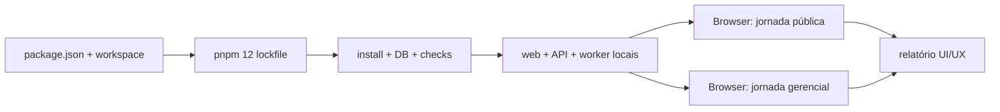

# Local Readiness and UI/UX Audit Design

**Spec**: `.specs/features/local-readiness-ui-audit/spec.md`
**Status**: Approved

## Architecture Overview

A migração mantém o monorepo, o pin exato e o lockfile multi-documento oficial do pnpm 12. A política de scripts autoriza somente as versões travadas do esbuild e nega o postinstall opcional do MSW. A validação usa PostgreSQL e storage descartáveis, com providers externos desativados no processo. Depois do gate, o Browser integrado percorre as jornadas reais e salva capturas inspecionadas para um relatório combinado de UX e acessibilidade.

## Code Reuse Analysis

| Existing component   | Location                 | How to use                                                      |
| -------------------- | ------------------------ | --------------------------------------------------------------- |
| Package-manager pin  | `package.json`           | Fonte da versão usada por Corepack e CI.                        |
| Build-script policy  | `pnpm-workspace.yaml`    | Declara scripts permitidos/negados sem prompt.                  |
| Local infrastructure | `docker-compose.yml`     | PostgreSQL 16 em porta configurável.                            |
| Migrations and seed  | `packages/database/src/` | Preparar catálogo e filas reais em banco descartável.           |
| Existing E2E         | `apps/web/e2e/`          | Provar regressões funcionais sem substituir a auditoria visual. |
| Public/admin routes  | `apps/web/src/`          | Superfícies reais percorridas pelo Browser.                     |

## Components

### Package-manager contract

- **Purpose**: Manter um único arquivo de lock coerente, com o documento de ambiente e o grafo do workspace exigidos pelo pnpm 12.3.4.
- **Location**: `package.json`, `pnpm-workspace.yaml`, `pnpm-lock.yaml`.
- **Dependencies**: Corepack e manifests do workspace.
- **Reuses**: Pin já escolhido pelo usuário.

### Isolated local runtime

- **Purpose**: Provar aplicação completa sem dados ou providers reais.
- **Location**: processos locais e artefato de validação da feature.
- **Dependencies**: PostgreSQL descartável, migrations, seed e storage temporário.
- **Reuses**: fallbacks locais existentes.

### Evidence-based audit

- **Purpose**: Registrar a experiência atual do cliente e do admin antes do redesign.
- **Location**: `docs/ui-ux-audit.md` e `output/product-design/ui-ux-audit-2026-09-06/`.
- **Dependencies**: runtime local estável e Browser integrado.
- **Reuses**: rotas e estados reais do produto.

## Error Handling Strategy

| Error scenario                               | Handling                                              | User impact                                  |
| -------------------------------------------- | ----------------------------------------------------- | -------------------------------------------- |
| Lockfile regenerado diverge além do contrato | Parar e revisar diff antes de aplicar                 | Migração não esconde upgrade de dependência. |
| Porta local ocupada                          | Escolher porta explícita disponível                   | Não interrompe processos do usuário.         |
| Provider real aparece no fluxo               | Manter credencial vazia e não concluir a ação externa | Auditoria registra o limite.                 |
| Captura inválida                             | Rejeitar, estabilizar a tela e recapturar             | Relatório não usa evidência falsa.           |

## Risks & Concerns

| Concern                                                    | Location                   | Impact                                      | Mitigation                                                   |
| ---------------------------------------------------------- | -------------------------- | ------------------------------------------- | ------------------------------------------------------------ |
| Leitores antigos podem interpretar só o primeiro documento | `pnpm-lock.yaml:1`         | Scanner pode reportar zero dependências     | Usar pnpm nativo e documentar o formato multi-documento.     |
| Config de exemplo diverge do default seguro                | `.env.example`             | Áudio pode avançar automaticamente em local | Alinhar `AUDIO_REVIEW_MODE=manual`.                          |
| Credenciais reais existem localmente                       | `.env`                     | Audit pode gastar provider                  | Sobrescrever variáveis no processo e nunca imprimir valores. |
| API e worker compartilham banco de teste                   | `.github/workflows/ci.yml` | Paralelismo causa deadlock                  | Preservar teste serializado.                                 |
| Screenshots não provam acessibilidade completa             | UI audit                   | Falso senso de conformidade                 | Separar achados visuais de lacunas de teclado/AT/contraste.  |

## Tech Decisions

| Decision         | Choice                                                 | Rationale                                         |
| ---------------- | ------------------------------------------------------ | ------------------------------------------------- |
| Migração         | Preservar o lock multi-documento e provar estabilidade | É o formato oficial do pnpm 12, não corrupção.    |
| Runtime auditado | Fallback local com providers externos vazios           | Prova o produto sem custo ou efeito externo.      |
| Auditoria        | Browser atual, desktop e reflow móvel                  | Evidência visual recente nas duas superfícies.    |
| UI changes       | Nenhuma nesta entrega                                  | A direção visual será escolhida após a auditoria. |

## Testing Strategy

- Frozen install em estado limpo e verificação de estabilidade do lockfile.
- Migrations e seed em PostgreSQL descartável.
- Format, lint, typecheck, 119 testes existentes, build e Playwright.
- Health/readiness e catálogo no runtime local.
- Capturas atuais inspecionadas e achados vinculados a cada etapa.
