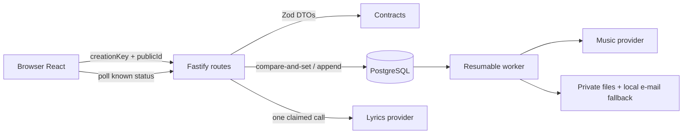

# MVP Operável Design

**Spec**: `.specs/features/mvp-operavel/spec.md`  
**Status**: Approved by the autonomous execution authorization in the brief

## Chosen Approach

Usar fatias verticais cirúrgicas dentro dos módulos atuais. Contratos definem chaves e DTOs; PostgreSQL garante idempotência e claim; handlers continuam pequenos; React deriva a interface de estados tipados. Esta opção preserva o monólito e corrige o fluxo sem reescrever o produto.

Alternativas consideradas:

| Approach | Strength | Cost / reason not chosen |
| --- | --- | --- |
| **Comparação atômica + polling no desenho atual** | Menor mudança, usa banco e testes existentes, recupera reload e crash | Geração de letra continua dentro do request da API. **Escolhida.** |
| Mover geração de letra para o worker | Duração totalmente desacoplada do request e fila uniforme | Amplia contrato, job types, UI e operação além do necessário para o MVP. |
| Reescrever frontend e API como uma única máquina de estados nova | Modelo conceitual uniforme | Blast radius alto, risco de regredir fluxos entregues e conflito com a instrução de evitar reescrita ampla. |

## Architecture Overview



O browser nunca recebe UUID interno. O primeiro envio usa uma chave aleatória persistida até o salvamento completo; a API guarda somente o SHA-256 e devolve o mesmo `publicId` em retry. Geração faz update condicional para `lyrics_generating`; uma segunda requisição recebe 409, enquanto claim com mais de cinco minutos pode ser retomado. Cookies de pedido e visualização usam a assinatura de `@fastify/cookie`.

## Visual Direction

### Subject and single job

O produto é um estúdio guiado para brasileiros transformarem histórias de amigos em uma música. O trabalho único de cada tela é deixar inequívoca a próxima ação até ouvir duas versões.

### Tokens

| Role | Token |
| --- | --- |
| Papel | `#FFFAF5` |
| Fita pêssego | `#FFE9DA` |
| Laranja de gravação | `#E9532D` |
| Tinta | `#202022` |
| Texto secundário | `#625B56` |
| Sucesso | `#176B40` |

- **Display**: Bricolage Grotesque 600–700, apenas h1/h2 e título da música.
- **Body**: Outfit 400–700 para leitura e controles.
- **Utility**: DM Mono 500–700 para etapas, estados e referências públicas.
- **Scale**: display `clamp(2.35rem, 6vw, 5.75rem)`; h1 interno `clamp(2.15rem, 5vw, 4.25rem)`; h2 `clamp(1.65rem, 3vw, 2.75rem)`; corpo 1rem/1.6.
- **Spacing**: base 4 px; gutters 24 px mobile, 40 px desktop; conteúdo principal 760 px; landing 1120 px.
- **Shape**: raios de 10, 16 e 999 px; borda `#D9CEC5`; sombra usada apenas em elementos elevados e toast.

### Signature

A “faixa de produção” é o elemento memorável. Uma linha contínua liga História, Letra, Pagamento, Produção e Entrega; cada marcador mostra concluído, atual ou aguardando. Ela traduz a trilha de gravação em informação, não decoração.

### Layout options and selected wireframe

Desktop selecionado:

```text
┌ marca ───────────────── navegação ─── CTA ┐
│ eyebrow                                  │
│ Título legível da etapa                  │
│ explicação / status vivo                 │
│ ●━━━━●━━━━◉━━━━○━━━━○  faixa             │
│                                          │
│ conteúdo principal          contexto     │
│ editor / formulário          resumido     │
│                                          │
│ [ação secundária] [ação principal]       │
└ rodapé mínimo ───────────────────────────┘
```

Mobile selecionado:

```text
┌ marca                        menu ┐
│ ETAPA / STATUS                    │
│ Título em 2–3 linhas              │
│ ●━━●━━◉━━○━━○                     │
│ conteúdo em uma coluna            │
│ mensagem de erro/status próxima   │
│ [ ação principal com 44 px ]      │
└───────────────────────────────────┘
```

### Self-critique before build

O primeiro plano corria o risco de parecer outro dashboard com cinco cards de status. A faixa única substitui os cards e mantém a metáfora musical funcional. O risco estético fica concentrado na tipografia de display e na faixa; gradientes, ondas desenhadas e cards decorativos foram removidos. A landing mantém seu hero característico, mas telas operacionais ficam mais quietas e densas.

## Code Reuse Analysis

### Existing Components to Leverage

| Component | Location | How to Use |
| --- | --- | --- |
| `Header`, `Footer`, `Loading` | `apps/web/src/components.tsx` | Melhorar sem trocar navegação ou iconografia Lucide. |
| React Query hooks | `apps/web/src/pages/public.tsx` | Polling condicionado ao status e invalidação após mutações. |
| `useDraft` / `my-orders` | `apps/web/src/hooks/use-draft.ts`, `apps/web/src/my-orders.ts` | Manter recuperação local e limite histórico. |
| Schemas e status | `packages/contracts/src/index.ts` | Adicionar creation key e DTO público; reutilizar enums. |
| `assertTransition` | `packages/domain/src/index.ts` | Continuar como única porta de mudança de status. |
| Drizzle + PostgreSQL | `packages/database/src/schema.ts` | Hash idempotente aditivo e claim condicional. |
| `fastify.inject` + PG real | `apps/api/src/flow.test.ts` | Provar cookie, DTO, concorrência e efeitos únicos. |
| Worker tests | `apps/worker/src/flow.test.ts` | Preservar prova de duas variantes e retomada. |

### Integration Points

| System | Integration Method |
| --- | --- |
| Browser → API | DTOs públicos por `publicId`, cookie assinado e `creationKey` UUID. |
| API → PostgreSQL | Inserts idempotentes, versões append-only e update compare-and-set. |
| API → lyrics provider | Uma chamada por claim, usage ledger por tentativa. |
| Payment fallback | Endpoint por `publicId` com cookie assinado, apenas fora de produção. |
| Worker → delivery | Estado só chega a `delivered` com duas variantes completas. |

## Components and Interfaces

### Public contracts

- **Purpose**: validar idempotência e a forma exata de catálogo/checkout.
- **Location**: `packages/contracts/src/index.ts`
- **Interfaces**:
  - `createOrderSchema` recebe `productType`, `visitorId?`, `creationKey` UUID.
  - `publicProductSchema` contém `type`, `name`, `priceCents`, `active`.
- **Dependencies**: Zod.
- **Reuses**: `productTypeSchema`, `uuidSchema`.

### Access cookie helpers

- **Purpose**: emitir e validar capabilities assinadas de pedido/visualização.
- **Location**: `apps/api/src/app.ts`
- **Interfaces**:
  - `setAccessCookie(reply, kind, publicId)`.
  - `hasSignedAccess(kind, publicId, request): boolean`.
- **Dependencies**: `@fastify/cookie` e `COOKIE_SECRET` já configurados.
- **Reuses**: mesmos nomes, flags HttpOnly/SameSite/Secure.

### Idempotent order creation

- **Purpose**: reutilizar pedido após resposta perdida.
- **Location**: `orders.creation_key_hash`, handler `POST /orders`.
- **Interfaces**: SHA-256 da chave; índice único nullable; resposta pública existente.
- **Dependencies**: PostgreSQL/Drizzle e `node:crypto`.
- **Reuses**: `hashToken` ou helper SHA-256 equivalente, `recordEvent` apenas no primeiro insert.

### Lyrics claim

- **Purpose**: impedir chamadas concorrentes e permitir recuperação de claim abandonado.
- **Location**: handler `POST /orders/:publicId/lyrics/generate`.
- **Interfaces**: update condicional com `returning`; conflito 409; timeout de 300.000 ms.
- **Dependencies**: status e `updatedAt` do pedido.
- **Reuses**: `assertTransition`, `validateLyrics`, `recordLyricsUsage`.

### RouteFocus

- **Purpose**: rolar e focar o conteúdo após mudança de pathname.
- **Location**: `apps/web/src/components.tsx`, montado em `main.tsx`.
- **Interfaces**: observa `useLocation`; foca o primeiro `main` com `tabIndex=-1`.
- **Dependencies**: React Router.
- **Reuses**: estrutura de rotas atual.

### ProductionRail

- **Purpose**: traduzir status conhecido nas cinco etapas visíveis.
- **Location**: `apps/web/src/components.tsx`.
- **Interfaces**: `status: OrderStatus`; rótulos e estados derivados de função pura.
- **Dependencies**: tipos locais alinhados aos contratos.
- **Reuses**: conteúdo atual de acompanhamento.

### Public journey pages

- **Purpose**: renderizar catálogo, form, geração, revisão, checkout e entrega com estados explícitos.
- **Location**: `apps/web/src/pages/public.tsx`.
- **Interfaces**: React Query/mutations existentes, novos guards `isOrderStatus` e `products()`.
- **Dependencies**: API client, React Hook Form, Sonner.
- **Reuses**: rotas e estruturas atuais; não cria camada service/DI.

## Data Models

### orders.creation_key_hash

```typescript
type CreationIdentity = {
  creationKeyHash: string | null; // SHA-256 hex, unique when present
};
```

Migration `0004_mvp_operavel.sql` adiciona a coluna nullable e índice único. Linhas existentes continuam válidas e não recebem valor inventado.

### Public product

```typescript
type PublicProduct = {
  type: ProductType;
  name: string;
  priceCents: number;
  active: boolean;
};
```

### Public order status

`OrderStatus` é união fechada. Qualquer string fora do contrato produz estado inconsistente visível e bloqueia CTAs de mutação.

## Error Handling Strategy

| Error Scenario | Handling | User Impact |
| --- | --- | --- |
| Form inválido | RHF foca primeiro erro; ARIA associa mensagem | Corrige sem perder campos. |
| Create/save após resposta perdida | Reenvia mesma `creationKey` | Mesmo pedido é retomado. |
| Geração já em curso | API 409; página segue polling | Nenhuma segunda cobrança. |
| Claim envelhecido | Novo update condicional permite retry único | Recupera interrupção após 5 min. |
| Falha de letra | Status `failed` + CTA de retry | Pessoa tenta novamente antes de pagar. |
| Falha de edição/aprovação | Alert local + draft mantido | Nenhum texto some. |
| Catálogo indisponível | Sem preço estático; criação segue | Não há promessa comercial divergente. |
| Pagamento dev sem cookie | 401 antes de consultar/mutar | Referência pública sozinha não basta. |
| Status desconhecido | Página de inconsistência, sem polling/CTA | Falha explícita em vez de sucesso falso. |
| Áudio pago falhou | Mensagem honesta, sem auto-retry do cliente | Acompanhamento continua; operação decide custo. |

## Risks & Concerns

| Concern | Location | Impact | Mitigation |
| --- | --- | --- | --- |
| Cookie literal aceito como acesso | `apps/api/src/app.ts:237` | Bypass de privacidade | Assinar/verificar e testar cookie forjado. |
| DTO de produtos expõe linha completa | `apps/api/src/app.ts:285` | UUID/timestamps públicos | Projeção explícita e teste de chaves exatas. |
| Payment UUID atravessa checkout | `apps/api/src/app.ts:527` | ID interno e mutação dev fraca | Rota por `publicId` + cookie; remover campo. |
| Geração aceita estado em curso | `apps/api/src/app.ts:365` | Custo/versionamento duplicado | Claim condicional e conflito 409. |
| Aprovação atual altera `approvedAt` da versão | `apps/api/src/app.ts:488` | Viola histórico imutável | Anexar versão aprovada em vez de atualizar a base. |
| Componente público concentra muitas páginas | `apps/web/src/pages/public.tsx` | Mudanças visuais podem colidir | Alterações pequenas e testes por estado; divisão de arquivo é P2. |
| Status é `string` no frontend | `apps/web/src/types.ts:27` | `undefined` vira produção | União fechada e guard runtime. |
| Heading tracking global | `apps/web/src/styles.css:190` | Palavras visualmente coladas | Tokens e estilos por nível. |
| Nenhum foco/scroll de rota | `apps/web/src/main.tsx` | Próxima etapa abre cortada | `RouteFocus` testado no E2E. |
| Build público acima de 500 kB | build baseline | Custo móvel | Admin já lazy; registrar otimização adicional P2. |
| Fastify avisa depreciação de `disableRequestLogging` | `apps/api/src/app.ts:120` | Migração futura para Fastify 6 | Backlog P2; não ampliar mudança de segurança atual. |

## Tech Decisions

| Decision | Choice | Rationale |
| --- | --- | --- |
| Idempotência de criação | UUID do browser, hash SHA-256 único no pedido | Reusa retry sem expor ou persistir chave bruta. |
| Concorrência de letra | Compare-and-set com timeout de 5 min | Resolve custo duplicado sem nova fila. |
| Acesso público | Cookie assinado de capability | Menor mudança segura sobre a fronteira atual. |
| Imutabilidade de letra | Aprovação cria nova versão | Conteúdo e metadados históricos não são reescritos. |
| Estado de UI | União fechada + guard runtime | Fixture incompleta não vira estado de sucesso. |
| Identidade visual | Três fontes por papel e faixa de produção | Específico ao estúdio musical, sem dashboard genérico. |
| Motion | Uma transição curta no marcador atual | Feedback funcional e fácil de remover em reduced motion. |
