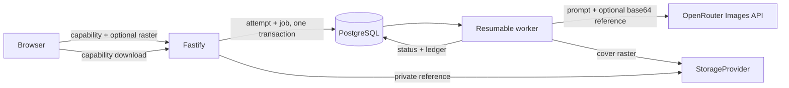

# P2 Readiness Design

**Status:** Approved by autonomous execution authorization

## Architecture

`album_covers` é histórico por `(order_id, attempt)`. A primeira solicitação cria tentativa 1 e `cover:<orderId>:1`; regenerar cria tentativa 2. O worker consulta história e letra aprovada no banco, monta prompt com campos limitados e chama o provider uma vez por tentativa. O job técnico pode ser retomado sem criar nova tentativa de produto.

## API

- `POST /api/v1/orders/:publicId/cover`: JSON sem foto ou multipart com `reference` e `consent=true`.
- `GET /api/v1/orders/:publicId/cover`: resumo público para acesso de edição ou visualização.
- `GET /api/v1/orders/:publicId/cover/download`: asset concluído por capability.
- `GET /api/v1/deliveries/:token/cover/download`: asset concluído por token de entrega.

Responses usam `status`, `attempt`, `canRegenerate`, `hasReference`, `createdAt` e `downloadUrl?`. IDs internos e storage keys não saem.

## Upload

Fastify recebe corpo multipart por `@fastify/multipart`, limita um arquivo e 8 MiB. O helper valida magic bytes para JPEG, PNG e WebP. A referência recebe nome aleatório. Formatos ativos, tipos divergentes e consentimento ausente são rejeitados antes de persistir tentativa ou job.

Exif e metadados ficam fora do arquivo persistido por re-encode com `sharp`, com orientação aplicada e limite de 2048 px. O mesmo passo normaliza para JPEG. O worker remove a referência em `finally` ao concluir ou falhar terminalmente; retries transitórios preservam o arquivo.

## Provider

O adapter usa `POST https://openrouter.ai/api/v1/images` com `model`, prompt, `resolution: "1K"`, `aspect_ratio: "1:1"`, `n: 1` e `input_references` somente quando houver foto. A resposta precisa ter exatamente um item raster base64. Timeout: 120 s. Erros externos são sanitizados antes do job/ledger.

## Web

O card “Capa do single” aparece na entrega do pedido e no link privado. A sessão dona pode gerar/regenerar; sessão de visualização só baixa. O upload usa preview local, limite anunciado, consentimento próximo ao controle e status em `aria-live`. A composição visual imita uma capa física sobre papel pêssego, sem dashboard novo.

Rotas operacionais públicas passam a imports dinâmicos. `Landing` fica no entry porque é a primeira visita e não depende de React Hook Form/Zod.

## Operations

Storage continua atrás de `StorageProvider`. O adapter S3 compatível é selecionado por `STORAGE_PROVIDER=s3`, usa bucket privado e nunca gera URL pública. Download segue exclusivamente pela API autenticada. O adapter local permanece apenas fora de produção.

Runbooks separam `READY LOCALLY`, `EXTERNAL BLOCKED` e a evidência que promove cada integração. Backup/restore usa PostgreSQL e objetos, com checksums e ambiente isolado.

## Failure Rules

- Provider indisponível antes do enqueue: 503 sem tentativa criada.
- Retry transitório: mesmo job/attempt e referência preservada.
- Falha terminal: cover `failed`, ledger/error sanitizado e referência removida.
- Falha da capa não muda pedido nem áudio.
- Output inválido ou SVG é falha terminal.
