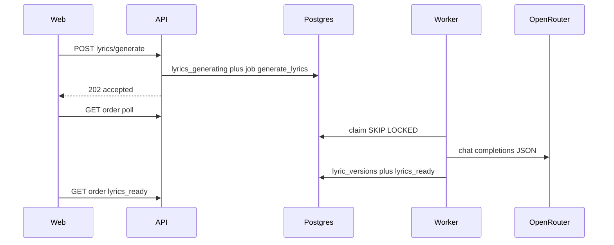

# Platform Foundation Design

> Registro histórico de um recorte anterior. O modelo vigente e a evidência atual estão em [docs/documentation-map.md](../../../docs/documentation-map.md) e [audit-remediation](../audit-remediation/spec.md). Este registro não autoriza publicação nem gasto com providers.

**Spec**: `.specs/features/platform-foundation/spec.md`
**Status**: Approved (plano `carcaça_da_plataforma`)

---

## Architecture Overview

HTTP só autentica, valida Zod/`evaluateContent`/limite e, numa transação, faz `assertTransition` → `lyrics_generating` + `enqueueJob`. O worker reivindica com `FOR UPDATE SKIP LOCKED`, lê `story_sessions`, chama OpenRouter via adapter compartilhado e persiste versão + `ai_usage`.



Não há Redis, container de DI nem classe de service. Funções pequenas, deps explícitas no argumento.

---

## Code Reuse Analysis

### Existing Components to Leverage

| Component         | Location                                      | How to Use                                                                        |
| ----------------- | --------------------------------------------- | --------------------------------------------------------------------------------- |
| Fila              | `packages/database/src/jobs.ts`               | `enqueueJob`, `claimNextJob`, `releaseStaleJobs`, `failJob`                       |
| Transições        | `packages/domain`                             | `assertTransition`, `validateLyrics`, `sanitizeAiError`                           |
| Schemas HTTP      | `packages/contracts`                          | `generateLyricsSchema`, `generatedLyricsSchema`; novos payloads de job            |
| Provider de letra | `apps/api/src/providers.ts`                   | Mover `musicalStory` + `createOpenRouterLyricsProvider` para `packages/providers` |
| Claim de áudio    | `apps/worker/src/worker.ts` `processAudioJob` | Mesmo seam: provider injetado no teste                                            |
| Poll UI           | `apps/web/src/pages/public.tsx`               | Já refetch 1,5s em `lyrics_generating`                                            |
| Recovery          | `apps/api/src/recovery.ts` `jobRecovery`      | Estender `generate_lyrics`                                                        |
| Preview           | `scripts/local-preview.sh`                    | `PREVIEW_AI=lyrics` também no worker                                              |

### Integration Points

| System          | Integration Method                                                                      |
| --------------- | --------------------------------------------------------------------------------------- |
| OpenRouter chat | `fetch` no adapter compartilhado; worker passa `apiKey`, `model`, `maxTokens`, `webUrl` |
| Postgres        | Migration Drizzle versionada `0009`; compose local 18                                   |
| Admin           | Mesmo `POST /admin/jobs/:id/retry`; generate admin enfileira                            |
| Preview         | Env de texto no processo worker quando `PREVIEW_AI=lyrics`                              |

### CONCERNS.md mitigations

| Concern                | Design                                                       |
| ---------------------- | ------------------------------------------------------------ |
| IA no request da API   | Job `generate_lyrics`; HTTP accepted                         |
| Claim sem índice       | `(status, run_at)` + `order_id`                              |
| Arquivos monolíticos   | Split por área, sem DI                                       |
| Web fora dos contratos | Dependência `@resenha/contracts`                             |
| AD-002 CAS 5 min       | Substituído para letra por lock da fila (`releaseStaleJobs`) |

---

## Components

### Lyrics HTTP enqueue

- **Purpose**: Validar e enfileirar; não chamar o modelo.
- **Location**: módulo de rotas pedido/letra (hoje `generateOrderLyrics` em `apps/api/src/app.ts`)
- **Interfaces**:
  - `enqueueLyricsGeneration(order, body, administrative): { accepted: true, status: 'lyrics_generating' }`
- **Dependencies**: `generateLyricsSchema`, `evaluateContent`, `recoveryFor`, `generation_jobs`
- **Reuses**: lock `FOR UPDATE` no pedido; idempotência `lyrics:{orderId}:{nextVersion}`

### Lyrics job processor

- **Purpose**: Executar o loop atual de geração no worker.
- **Location**: `apps/worker/src/lyrics.ts` (`processLyricsJob`)
- **Interfaces**:
  - `processLyricsJob(pool, job, config, lyrics?: LyricsProvider): Promise<void>`
- **Dependencies**: `lyricsJobPayloadSchema`, `storySchema`, `validateLyrics`, adapter OpenRouter
- **Reuses**: padrão `processAudioJob` (provider opcional de teste)

### Shared lyrics adapter

- **Purpose**: Um `fetch` JSON para API (config/availability) e worker (execução).
- **Location**: `packages/providers/src/lyrics.ts`
- **Interfaces**:
  - `musicalStory(story): Record<string, unknown>`
  - `createOpenRouterLyricsProvider(config): LyricsProvider`
- **Dependencies**: `@resenha/contracts` (`generatedLyricsSchema`), tipo de usage alinhado ao domínio
- **Reuses**: prompt e regras atuais; sem SDK

### Job payload contracts

- **Purpose**: Worker deixa de aceitar JSON solto.
- **Location**: `packages/contracts/src/index.ts`
- **Interfaces**: schemas Zod `lyricsJobPayloadSchema`, `audioJobPayloadSchema`, `coverJobPayloadSchema`, `notifyJobPayloadSchema`
- **Dependencies**: Zod já no pacote
- **Reuses**: `lyricsRefinementSchema` para o bloco `refinement`

### API/worker modules

- **Purpose**: Quebrar arquivos-deus por fronteira.
- **Location**: `apps/api/src/routes/*.ts`; `apps/worker/src/{lyrics,audio,cover,notify,config}.ts`
- **Interfaces**: funções `registerX(app, deps)`; `createWorker` só faz dispatch
- **Dependencies**: objeto de deps explícito (não container)
- **Reuses**: helpers atuais (`fail`, `hasAccess`, `recoveryContext`)

### Web contracts

- **Purpose**: Um schema público.
- **Location**: `apps/web/src/types.ts` reexporta; `order-journey.ts` usa `orderStatusSchema`
- **Interfaces**: `ProductType`, `OrderStatus`, `GeneratedLyrics` / `LyricsContent`, refinement
- **Dependencies**: `@resenha/contracts`
- **Reuses**: DTOs só-de-UI (`OrderDetail`, `products` copy) permanecem locais

---

## Data Models (if applicable)

### Lyrics job payload

```typescript
type LyricsJobPayload = {
  refinement?: { instructions: string; baseVersion: number };
};
```

**Relationships**: `generation_jobs.order_id` → `orders`; worker lê `story_sessions` e `lyric_versions` pelo `baseVersion`.

### Idempotency

Chave `lyrics:{orderId}:{nextVersion}` onde `nextVersion` é `count(lyric_versions)+1` no enqueue. Regenerar/refinar depois de uma versão persistida usa chave nova. Retry HTTP do mesmo POST reutiliza a chave. Job `failed` com a mesma chave é reposto em `pending`.

### Indexes (migration)

- `generation_jobs (status, run_at)`
- `generation_jobs (order_id)`
- `payments (order_id)`
- `order_events (order_id)`
- `revision_requests (order_id)`
- `admin_notes (order_id)`
- `stored_files (order_id)`

Não alterar agregado `orders`. Não criar índices em `leads`/`order_items` nesta fatia.

---

## Error Handling Strategy

| Error Scenario                 | Handling                                           | User Impact                         |
| ------------------------------ | -------------------------------------------------- | ----------------------------------- |
| Validação Zod / conteúdo       | 400 antes do job                                   | Mensagem de campo; história intacta |
| Sem história / status inválido | 400/409                                            | Sem custo de IA                     |
| Letra indisponível             | 503                                                | História salva                      |
| Job em voo, mesmo payload      | 202 accepted                                       | Poll continua                       |
| Job em voo, payload diferente  | 409                                                | UI já desabilita envio              |
| Falha primeira geração         | pedido `failed`, job `failed`                      | “Tentar gerar novamente”            |
| Falha refinamento              | pedido `lyrics_ready`                              | Letra salva permanece               |
| Lock stale                     | `releaseStaleJobs`                                 | Worker retoma; HTTP não CAS         |
| Erro de provedor               | `sanitizeAiError`; DTO público via `publicFailure` | Sem PII/stack                       |

---

## Tech Decisions (only non-obvious ones)

| Decision       | Choice                                | Rationale                                              |
| -------------- | ------------------------------------- | ------------------------------------------------------ |
| Fila da letra  | Mesmo `generation_jobs`               | SKIP LOCKED já permite réplica; sem Redis              |
| HTTP status    | 202 + `{ accepted, status }`          | Alinha à capa; GET é a verdade                         |
| Payload        | Só refinement opcional                | Worker lê briefing no banco; nada de PII extra na fila |
| Claim stale    | Só `releaseStaleJobs`                 | Uma política; AD-002 deixa de valer para letra         |
| Adapter        | `packages/providers`, sem pacote novo | API e worker compartilham `fetch`                      |
| Worker config  | `OPENROUTER_TEXT_MODEL` + max tokens  | Já existiam na API; execução muda de processo          |
| Preview lyrics | Worker também recebe chave de texto   | Senão o job fica pending para sempre                   |
| Split          | Funções + deps objeto                 | AGENTS.md: sem services/classes/DI                     |
| Postgres local | 18-alpine                             | Railway já é 18; volume 16 fica; `0009` já aplicada    |
