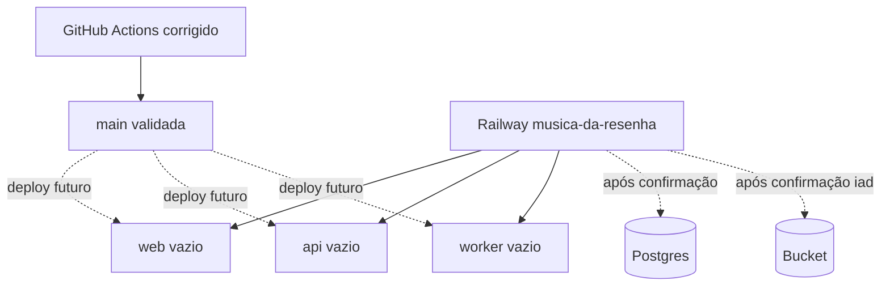

# Railway Bootstrap Design

> Registro histórico de um recorte anterior. O modelo vigente e a evidência atual estão em [docs/documentation-map.md](../../../docs/documentation-map.md) e [audit-remediation](../audit-remediation/spec.md). Este registro não autoriza publicação nem gasto com providers.

**Spec**: `.specs/features/railway-bootstrap/spec.md`
**Status**: Approved by explicit bootstrap request

## Architecture Overview

O bootstrap usa configuração local versionada como contrato e o MCP Railway como plano de controle. A estrutura externa é criada vazia para impedir deploy antes dos secrets e dos gates.

## Code Reuse Analysis

| Component       | Location                                  | How to Use                                            |
| --------------- | ----------------------------------------- | ----------------------------------------------------- |
| Dockerfiles     | `docker/{web,api,worker}/Dockerfile`      | Fonte dos ports, build e runtime futuros.             |
| Storage adapter | `packages/providers/src/storage.ts`       | Consumir referências S3 do Bucket sem novo adapter.   |
| Migration/seed  | `packages/database/src/{migrate,seed}.ts` | Migration recorrente na API; seed inicial controlado. |
| Project memory  | `.specs/STATE.md`                         | Decisões duráveis e handoff verificável.              |

## Components

### CI workflow

- **Purpose**: disponibilizar pnpm antes do cache e executar o gate de format.
- **Location**: `.github/workflows/ci.yml`
- **Dependencies**: `packageManager` do `package.json` e lockfile limpo no commit.

### Turbo test environment

- **Purpose**: repassar somente as variáveis declaradas aos testes e impedir concorrência entre suítes que truncam o mesmo banco no CI.
- **Location**: `turbo.json` e comando de teste do workflow.
- **Dependencies**: PostgreSQL descartável e `DATABASE_URL_TEST`.

### Operational context

- **Purpose**: fonte canônica para arquitetura, boundaries e gate vocabulary.
- **Location**: `docs/project-context.md`
- **Dependencies**: código, docs e estado externo atual.

### Railway control plane

- **Purpose**: projeto privado e serviços vazios sem deployment.
- **Location**: MCP Railway.
- **Dependencies**: workspace autenticado, ausência de homônimo e ambiente padrão.

## Error Handling Strategy

| Error Scenario                  | Handling                                        | User Impact                                       |
| ------------------------------- | ----------------------------------------------- | ------------------------------------------------- |
| pnpm ausente no setup-node      | instalar com `pnpm/action-setup` antes do cache | workflow chega ao install                         |
| projeto/serviço homônimo        | reler e reutilizar/parar                        | evita duplicação                                  |
| Postgres/Bucket cria deployment | não criar nesta execução                        | etapa fica explicitamente pendente                |
| WIP lockfile inválido           | validar em cópia limpa de HEAD                  | WIP preservado; gate local real marcado bloqueado |

## Risks & Concerns

| Concern                              | Location (file:line)      | Impact                                | Mitigation                                         |
| ------------------------------------ | ------------------------- | ------------------------------------- | -------------------------------------------------- |
| lockfile local contém dois YAML docs | `pnpm-lock.yaml:1`        | format/install local não é confiável  | não tocar; validar correção do CI em scratch limpo |
| readiness só prova `select 1`        | `apps/api/src/app.ts:351` | serviço pode ficar ready sem catálogo | smoke futuro inclui `/products` após seed          |
| bucket sem backup automático         | `docs/railway-setup.md`   | perda operacional                     | export/restore externo antes de produção           |
| web usa localhost sem `VITE_API_URL` | `apps/web/src/api.ts:13`  | bundle publicado apontaria errado     | não deployar antes de domínio/API vars             |

## Tech Decisions

| Decision     | Choice                                   | Rationale                                           |
| ------------ | ---------------------------------------- | --------------------------------------------------- |
| Bootstrap    | serviços vazios antes de conectar GitHub | evita primeiro deploy inválido                      |
| Schema owner | pre-deploy da API                        | garante uma única execução recorrente de migrations |
| Seed         | ativação inicial separada                | evita acoplar dados operacionais a todo deploy      |
