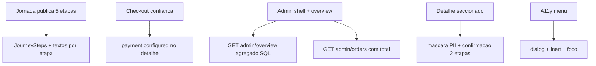

# UI Remodel Design

**Spec**: `.specs/features/ui-remodel/spec.md`
**Status**: Draft

---

## Architecture Overview

Remodelagem estritamente sobre a web existente. Nenhum endpoint muda contrato de forma quebrada: dois acréscimos aditivos na API (`payment` no detalhe público e `overview`/`total` no admin) sustentam os estados que a auditoria exige antes do clique e fora da primeira página.



---

## Code Reuse Analysis

### Existing Components to Leverage

| Component                                             | Location                                                       | How to Use                                                                             |
| ----------------------------------------------------- | -------------------------------------------------------------- | -------------------------------------------------------------------------------------- |
| `ProductionRail` + `deriveOrderJourney`               | `apps/web/src/components.tsx`, `apps/web/src/order-journey.ts` | Base dos cinco passos; estender com `JourneySteps` para etapas 1-3 sem duplicar lógica |
| `CreateStory`, `LyricsReview`, `Checkout`, `MyOrders` | `apps/web/src/pages/public.tsx`                                | Editar rótulos, preparação, resumo e autocomplete no lugar                             |
| `Header`, `Footer`, `Loading`                         | `apps/web/src/components.tsx`                                  | Reusar; evoluir `Header` para menu com contenção                                       |
| `AdminDashboard`, `AdminOrders`, `AdminOrderDetail`   | `apps/web/src/admin/routes.tsx`                                | Envolver em shell, trocar métricas por overview, seccionar detalhe                     |
| `api` client + `adminOrdersQuerySchema`               | `apps/web/src/api.ts`, `packages/contracts/src/index.ts`       | Estender tipos de forma aditiva; filtros seguem o schema                               |
| Testes RTL + Playwright                               | `apps/web/src/*.test.tsx`, `apps/web/e2e/*.spec.ts`            | Estender cobertura no mesmo padrão                                                     |

### Integration Points

| System      | Integration Method                                                                  |
| ----------- | ----------------------------------------------------------------------------------- |
| API pública | `GET /orders/:publicId` ganha `payment: { configured, devFallback }` aditivo        |
| API admin   | Novo `GET /admin/overview` agregado; `GET /admin/orders` ganha `total` + `pageSize` |
| Banco       | Contagens e somas via SQL (`count`, `sum numeric::text`); sem nova tabela           |

---

## Components

### JourneySteps (público)

- **Purpose**: Trilho único "Etapa N de 5" com nomes e `aria-current="step"`.
- **Location**: `apps/web/src/components.tsx` (novo export, mesmo arquivo)
- **Interfaces**:
  - `JourneySteps({ step }: { step: 1 | 2 | 3 | 4 | 5 }): JSX.Element`
- **Dependencies**: Nenhuma nova.
- **Reuses**: Tokens `.steps`, `.production-rail`; rótulos de `deriveOrderJourney`.

### Preparação de letra + revisão preservada

- **Purpose**: Explicar antes de gerar; manter editar/salvar/aprovar.
- **Location**: `apps/web/src/pages/public.tsx` (`LyricsWorkspace`, `LyricsGenerateAction`)
- **Interfaces**: Sem mudança de assinatura; somente cópia e blocos informativos.
- **Dependencies**: `api.generateLyrics` inalterado.
- **Reuses**: `LyricEditor` atual.

### Checkout com confiança

- **Purpose**: Resumo, redirecionamento, estado do provider e pendências jurídico-comerciais.
- **Location**: `apps/web/src/pages/public.tsx` (`Checkout`), `apps/web/src/api.ts` (tipo `payment`)
- **Interfaces**: `OrderDetail['payment']?: { configured: boolean; devFallback: boolean }`
- **Dependencies**: API aditiva.
- **Reuses**: `formatMoney`, `price-card`.

### AdminShell + overview + lista paginada

- **Purpose**: Navegação persistente, alertas primeiro, totais do servidor, filtros explícitos.
- **Location**: `apps/web/src/admin/routes.tsx`, novo `apps/web/src/admin/labels.ts`, `apps/web/src/admin/shell.tsx`
- **Interfaces**:
  - `AdminShell({ children, section }: { children: React.ReactNode; section: 'overview' | 'orders' })`
  - `adminOverview(): { totals, attention, funnel }`
  - `statusPt(status: string): string`, `eventPt(event: string): string`, `maskEmail(email: string): string`
- **Dependencies**: Novo `GET /api/v1/admin/overview`; lista com `total/pageSize`.
- **Reuses**: `Loading`, estilos `.admin`.

### Detalhe administrativo seccionado

- **Purpose**: Seções legíveis, PII mascarada, confirmação em duas etapas com efeito, escopo por faixa/conjunto.
- **Location**: `apps/web/src/admin/routes.tsx`
- **Interfaces**: Sem nova rota; compõe `AdminOrderDetail` existente.
- **Dependencies**: Tipos admin atuais.
- **Reuses**: `formatUsdExact`, `formatMoney`.

### Menu mobile contido

- **Purpose**: `dialog` modal com `inert` no fundo, ciclo de foco e `Escape` com restauração.
- **Location**: `apps/web/src/components.tsx` (`Header`), `apps/web/src/styles.css`
- **Interfaces**: Sem mudança de props.
- **Dependencies**: Nenhuma nova (usa `inert` nativo + fallback por `aria-hidden`).
- **Reuses**: Estilos `.site-header nav.open` existentes.

---

## Data Models (if applicable)

### Extensão pública aditiva

```typescript
type OrderDetail = {
  order: Order;
  story?: Story;
  lyrics: Lyrics[];
  audio: Audio[];
  privateAccess: boolean;
  payment?: { configured: boolean; devFallback: boolean };
};
```

**Relationships**: `payment.configured = Boolean(MERCADO_PAGO_ACCESS_TOKEN)`; `devFallback = !configured && NODE_ENV !== 'production'`. Sem persistência nova.

### Overview administrativo

```typescript
type AdminOverview = {
  totals: { orders: number; paid: number; revenueCents: number };
  attention: {
    failed: number;
    reviewRequired: number;
    audioQueued: number;
    lyricsGenerating: number;
  };
  funnel: Funnel;
};
```

**Relationships**: Agregações SQL sobre `orders` + funil existente; lista continua paginada em 30.

### Lista paginada

```typescript
type AdminOrdersResponse = { items: AdminOrder[]; page: number; total: number; pageSize: 30 };
```

**Relationships**: `total` via `count(*)` com os mesmos filtros; `items` inalterados.

---

## Error Handling Strategy

| Error Scenario                  | Handling                                      | User Impact                           |
| ------------------------------- | --------------------------------------------- | ------------------------------------- |
| Pedido sem acesso/inexistente   | `PageError` com retorno ao início             | Mensagem legível, sem PII             |
| Letra ausente em `lyrics_ready` | Estado inconsistente, sem edição              | Sem ação quebrada                     |
| Entrega parcial em `delivered`  | Inconsistente, sem player                     | Sem player falso                      |
| Checkout sem provider           | Botão desabilitado + motivo + `role="status"` | Falha conhecida antes do clique       |
| Falha de checkout               | `role="alert"`, sem navegação                 | Sem duplicação percebida              |
| Overview/lista indisponível     | Erro com nova tentativa                       | Sem métrica inventada                 |
| Storage local bloqueado         | Fallback em memória + aviso                   | Fluxo continua, rascunho não persiste |

---

## Risks & Concerns

| Concern                                                   | Location (file:line)                | Impact                      | Mitigation                                         |
| --------------------------------------------------------- | ----------------------------------- | --------------------------- | -------------------------------------------------- |
| `AdminOrders` refetch duplo (queryKey por tecla + submit) | `apps/web/src/admin/routes.tsx:183` | Tráfego e ambiguidade       | Filtros controlados + aplicação só no submit (T7)  |
| Métricas derivadas só da primeira página                  | `apps/web/src/admin/routes.tsx:54`  | Totais incompletos          | `GET /admin/overview` agregado (T2)                |
| JSON bruto com PII no detalhe                             | `apps/web/src/admin/routes.tsx:334` | Exposição de e-mail/payload | Seções + máscara (T8)                              |
| Menu sem `dialog`/`inert`/trap                            | `apps/web/src/components.tsx:23`    | Foco alcança fundo coberto  | `dialog` modal + `inert` + ciclo (T1)              |
| Progresso sem `aria-valuenow`                             | `apps/web/src/pages/public.tsx:146` | Leitor não entende etapa    | `JourneySteps` + `progressbar` (T4)                |
| WIP preexistente no worker                                | `apps/worker/src/worker.ts`         | Regressão acidental         | Não tocar no arquivo; `git diff` confere ao final  |
| Validação de filtro por data fuso SP                      | `apps/api/src/app.ts:1277`          | Quebra de filtro existente  | Manter lógica; só somar `total` com mesmos filtros |

> Tech-debt fora do escopo (providers embutidos em `apps/api/src/providers.ts` e `apps/worker/src/worker.ts`) permanece como está.

---

## Tech Decisions (only non-obvious ones)

| Decision            | Choice                                   | Rationale                                                  |
| ------------------- | ---------------------------------------- | ---------------------------------------------------------- |
| Filtros admin       | Aplicação explícita no submit            | Um único comportamento; elimina corrida queryKey × refetch |
| Confirmações admin  | Armar + confirmar inline                 | Sem modal novo; acessível e testável                       |
| `inert` no menu     | Nativo com fallback `aria-hidden`        | Sem dependência; cobre navegadores sem suporte             |
| Landing demo        | Bloco honesto sem `<audio>`              | Sem mídia real autorizada não há player honesto            |
| Políticas pendentes | Seção "A definir" + lançamento bloqueado | Não inventar jurídico/comercial                            |
