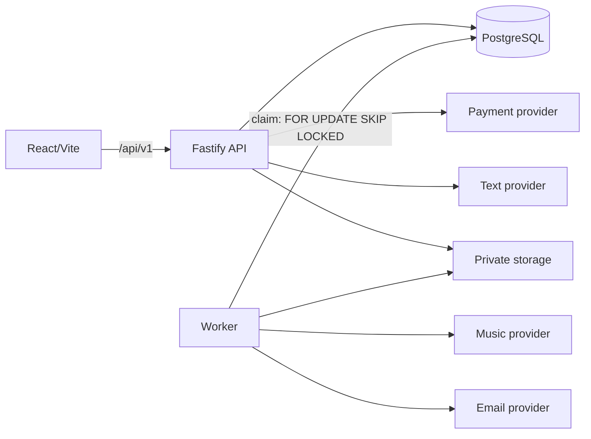

# Arquitetura — Música da Resenha

O produto é um monólito modular TypeScript: API e worker compartilham PostgreSQL, contratos e domínio. A web mantém tipos próprios, apresenta o fluxo e chama a API; regras, preços e transições ficam fora do navegador. O mapa operacional canônico está em [docs/project-context.md](docs/project-context.md).

## Fluxo

O wizard mantém o rascunho no navegador; `story_sessions` recebe a história quando o cliente confirma. `custom_song` usa tema e brief como inspiração, mantendo compatibilidade com os três produtos históricos. A criação usa uma chave UUID por tentativa e persiste só o hash; retries retornam o mesmo pedido. A geração de letra faz claim atômico e só recupera uma tentativa sem atualização após cinco minutos. Letras são versionadas e aprovação sempre anexa a cópia exata do texto visível. O servidor calcula preços em centavos, cria checkout e só inicia `generation_jobs` após pagamento confirmado. O worker reivindica jobs com `FOR UPDATE SKIP LOCKED`, aplica tentativas/backoff e gera duas versões. Por padrão, a revisão humana aprova o áudio antes de criar uma entrega com token revogável.

## Limites e decisões

- PostgreSQL é fonte de verdade e fila durável; não há Redis, microserviços ou Kubernetes.
- Providers são adapters reais selecionados por variáveis de ambiente (OpenRouter, AbacatePay, Resend); fora de produção, a ausência de credencial de pagamento/e-mail cai em fallback local (pagamento dev, e-mail em `var/emails`) — em produção as chaves dos adapters habilitados são obrigatórias. Pagamento disabled permite preparar o ambiente sem cobrar.
- O storage é privado: a API valida capability, estado da entrega e arquivo concluído antes de transmitir o download; não publica URLs de objetos.
- Acesso de pedido e visualização usa cookies de capability assinados e `HttpOnly`; um link de entrega concede apenas visualização.
- Respostas públicas carregam só referências públicas (`publicId`, número da versão de letra, variante do áudio); UUIDs internos ficam no admin autenticado. Logs HTTP usam template de rota e logs do worker omitem IDs internos. Mutações de cliente exigem o cookie assinado do pedido.
- Admin é único via `ADMIN_EMAIL`/`ADMIN_PASSWORD` de ambiente (decisão do dono; sem hash), cookie HttpOnly e sessão de 8h. Transições de status passam por `assertTransition`.

Veja também [docs/architecture.md](docs/architecture.md), que mantém o diagrama resumido original.

## Preparação comercial e entrega retomável

A API devolve configuração pública sanitizada, incluindo políticas e disponibilidade dos providers. A cobrança real exige preço positivo, condições publicadas e gateway habilitado. O catálogo não reprecifica pedidos já criados.

O worker persiste intenção imutável de e-mail antes de enviar; o token da entrega é derivado do ID da entrega e pepper, persistindo apenas hash. Retry conserva mensagem e link. A ação de revogação no admin invalida versões de cookies e links anteriores. Solicitação de ajuste após entrega muda para revision_requested e aparece no detalhe administrativo.
