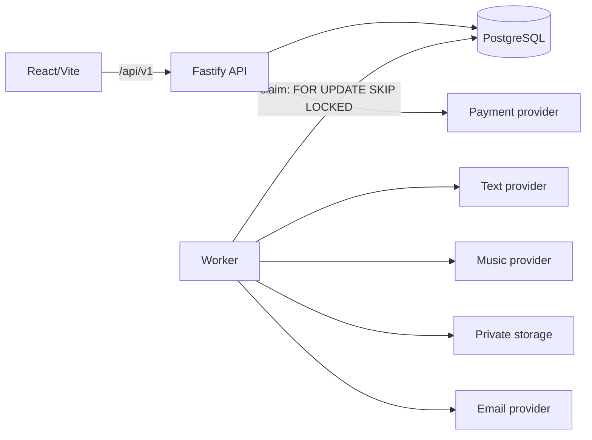

# Arquitetura — Música da Resenha

O produto é um monólito modular TypeScript: web, API e worker compartilham PostgreSQL, contratos e domínio. A web só apresenta fluxo e chama a API; regras, preços e transições ficam fora do navegador.

## Fluxo

Uma `story_session` tem token opaco e salva respostas progressivamente. A letra é versionada e só uma versão aprovada pode originar um pedido. O servidor calcula itens e preços em centavos, cria checkout e só inicia `generation_jobs` após pagamento confirmado por webhook idempotente. O worker reivindica jobs com `FOR UPDATE SKIP LOCKED`, aplica tentativas/backoff e gera duas versões. Por padrão, a revisão humana aprova o áudio antes de criar uma entrega com token revogável.

## Limites e decisões

- PostgreSQL é fonte de verdade e fila durável; não há Redis, microserviços ou Kubernetes.
- Providers são adapters reais selecionados por variáveis de ambiente (OpenRouter, Mercado Pago, Resend); sem chaves, as operações falham com mensagem clara.
- O storage é privado: a API valida token antes de disponibilizar download local ou URL assinada.
- IDs internos, segredos, payloads pessoais e histórias não entram em respostas públicas ou logs usuais.
- Admin usa Argon2id, cookie HttpOnly e auditoria. Transições de status passam por `assertTransition`.

Veja também [docs/architecture.md](docs/architecture.md), que mantém o diagrama resumido original.
