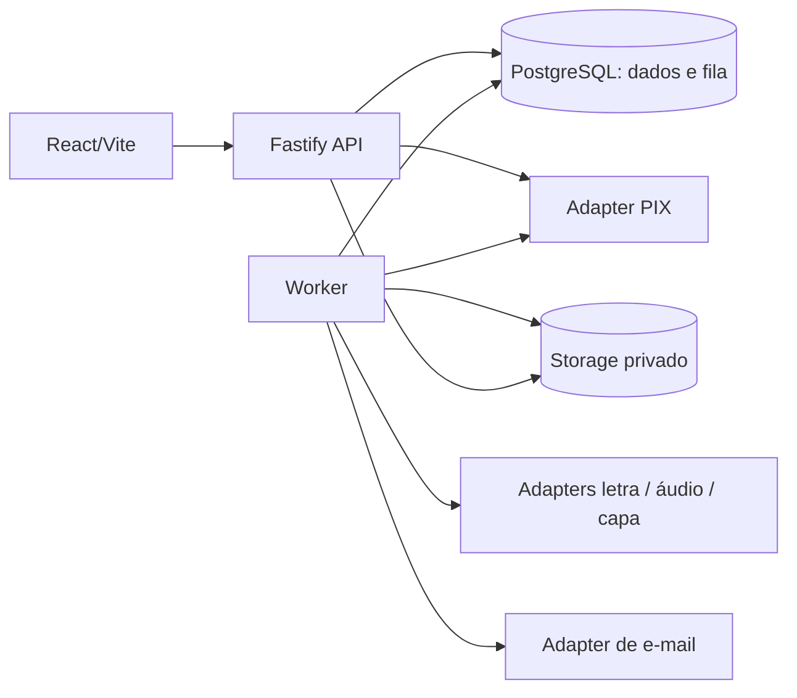
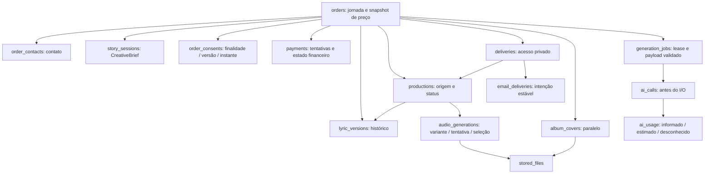

# Arquitetura

Mapa do código local na entrega `audit-remediation`, referência 2026-09-12. Publicação e validação final devem ser conferidas em [.specs/STATE.md](../.specs/STATE.md). O overview da raiz apenas aponta para este documento.

## Forma e fronteiras

Monólito modular TypeScript estrito/ESM: React/Vite, Fastify e worker contínuo, no mesmo repositório Turborepo/pnpm. PostgreSQL é dado e fila. Não há serviço separado por entidade, Redis ou framework de IA.

Contratos Zod ficam em `packages/contracts`; invariantes em `packages/domain`. Rotas cuidam de HTTP e autorização. `packages/database/src/payment-settlement.ts` concentra efeitos financeiros compartilhados; `jobs.ts` concentra claim, heartbeat e fencing. SQL explícito nestes caminhos serve locks e transações concretas. Drizzle descreve o schema e atende consultas ordinárias. Ambos devem concordar com as migrations.

`apps/api/src/routes/admin.ts` registra módulos de sessão, consulta, relatório, acesso, produção e recuperação. `context.ts` ainda reúne helpers usados por rotas; uma nova separação exige um consumidor/coerência identificável, não um service genérico. O worker despacha para `lyrics.ts`, `audio.ts`, `cover.ts` e `notify.ts`. Adapters não decidem transições do pedido.

## Agregado e fontes de verdade

- `products` contém somente `custom_song`. Mudanças de preço não alteram `orders.price_cents` existentes.
- `Story` é a composição do formulário; `CreativeBrief` exclui comprador, marketing, política e aceite. Leitura pode recompor contato e evidências explícitas, mas nunca cria aceite histórico ausente. Texto livre pode conter PII; não deve ir a logs.
- `lyric_versions` é histórico. `fullLyrics` é canônico; seções incompatíveis são descartadas. Resposta de IA exige estrutura/refrão; edição livre não inventa estrutura. Edição e aprovação também passam pelas regras locais de conteúdo.
- `productions.lyric_version_id` fixa a letra usada. Uma nova letra exige nova produção. Áudio histórico não é substituído: `production_id`, `variant`, `attempt`, `job_id`, `lease_token`, arquivo e duração identificam o resultado. Só uma geração selecionada por produção/variante.
- `orders.current_production_id` escolhe a produção corrente; `deliveries.production_id` identifica o material autorizado. FKs compostas impedem associar produção, letra, arquivo ou capa de outro pedido.
- `payments` tem `creating`, `unknown`, `pending`, `approved`, `refunded`, `rejected`, `cancelled`, `expired`. Uma tentativa ativa por pedido e identidades externas únicas são constraints. `orders.status=failed` pode coexistir com dinheiro recebido; receita não deve depender desse status.
- `order_events` registra transições e decisões operacionais. `analytics_events` guarda etapas pseudônimas do funil; não é livro contábil nem local para conteúdo criativo.

JSONB cabe no briefing variável, documento de letra, payloads de jobs, intenção de e-mail e metadados limitados de eventos. Identidades, contato, consentimento, valores, status e relações ficam em colunas/tabelas. `order_contacts.marketing_accepted` é a preferência atual; `order_consents` é a evidência histórica, inclusive recusa, para `terms`, `privacy`, `marketing`, `content_rights` e `reference_image`.

## Jornada transacional

1. Criação recebe chave por tentativa, persiste hash e devolve referência pública. Ao confirmar história, API salva briefing, contato e evidências da versão de política apresentada.
2. Gerar/refinar letra enfileira `generate_lyrics` e muda a jornada para `lyrics_generating` na mesma transação. O payload inclui `targetVersion`; refinamento inclui versão base. O worker não deduz a versão pelo total de linhas depois da rede.
3. Aprovação fixa o texto visível validado. Checkout persiste a tentativa antes do POST externo. Requisições concorrentes reutilizam a tentativa ativa.
4. Webhook autenticado ou reconciliação consulta o provider da tentativa e valida identidade, referência, valor e BRL. Settlement aplica a observação sem regressão financeira e cria produção/job apenas quando cabível. Refund revoga entrega e impede novos efeitos de produção.
5. Áudio é gerado para a letra fixada, com duas variantes sequenciais. Cada arquivo deve ser decodificável e ter ao menos dez segundos. Isso é validade técnica, não prova de canto, letra correta ou qualidade.
6. Em `manual`, o par fica em revisão humana. `automatic_release` libera sem audição. Liberação enfileira `deliver_notify`; o job de áudio conserva seu tipo.
7. Uma revisão posterior à liberação cria outra produção. Reaproveitar a faixa parceira da mesma letra cria uma seleção na nova produção com evento `audio_reused` apontando para produção/áudio de origem, preservando arquivo e custo histórico. Não gera consumo fictício. A entrega antiga permanece acessível enquanto a nova não é liberada.
8. E-mail guarda intenção por produção/template antes do envio e reusa o link. Uma produção revisada pode receber novo aviso sem duplicar a intenção da produção anterior. API valida capability, acesso, produção e arquivo para servir download privado. Capa é paralela e não muda o estado financeiro.

## Execução externa e incerteza

A fila usa `FOR UPDATE SKIP LOCKED`, limite de tentativas, backoff, token de lease e expiração. Heartbeat renova a posse; finalização e efeitos persistidos exigem posse vigente na transação. O identificador do worker serve diagnóstico, não prova de posse.

`ai_calls` é criado antes do I/O. Resultado materializado e conclusão da chamada são associados à transação pertinente. Uma chamada iniciada sem resultado conhecido passa a `unknown` e bloqueia repetição automática do mesmo tipo no pedido. O operador precisa registrar investigação e reconhecimento de possível custo duplicado para liberar recuperação; isso não converte custo desconhecido em zero.

`ai_usage` preserva o registro de consumo por chamada, inclusive rejeições/falhas. `reported` significa informado pelo provider, `estimated` significa estimativa do adapter, `unknown` mantém valor nulo. Soma dos valores conhecidos não é necessariamente custo completo.

PIX segue a mesma distinção entre falha confirmada e resultado incerto. Chave local única não garante idempotência no fornecedor. Quando o contrato externo não dá essa garantia, não se repete criação após timeout: busca-se a tentativa por referência opaca. Trocar gateway exige adapter completo; não muda o agregado de pedido.

## Infraestrutura, migração e limites

Runtime contratado: Node 22, pnpm 12.3.4; PostgreSQL 18 em compose/CI. Um volume local antigo pode continuar em 16. O projeto Railway conhecido é `musica`; conferir revisão implantada, journal e env antes de promoção. Bucket privado exige estratégia própria de backup de objetos. Backup de PostgreSQL não contém bytes do bucket.

Migrations `0000`–`0011` são preservadas. `0012` adiciona o novo modelo; origens antigas não demonstráveis ficam `legacy_unverified`, sem preencher consentimentos. `0013` só recupera `targetVersion` pela chave histórica inequívoca. `0014` associa e-mail à produção e substitui unicidade por pedido/template por unicidade da intenção em pedido/produção/template. Snapshot Drizzle atualizado descreve o schema corrente; validação deve comparar upgrade e instalação limpa com o catálogo real.

Default de concorrência é um. Duas variantes sequenciais são adequadas à demanda inicial desconhecida; não há capacidade comercial medida. Acompanhar idade da fila, duração, erros, chamadas desconhecidas e tempo de revisão humana antes de aumentar concorrência. Lease protege o banco, não desfaz uma cobrança ou um envio já aceito externamente.
