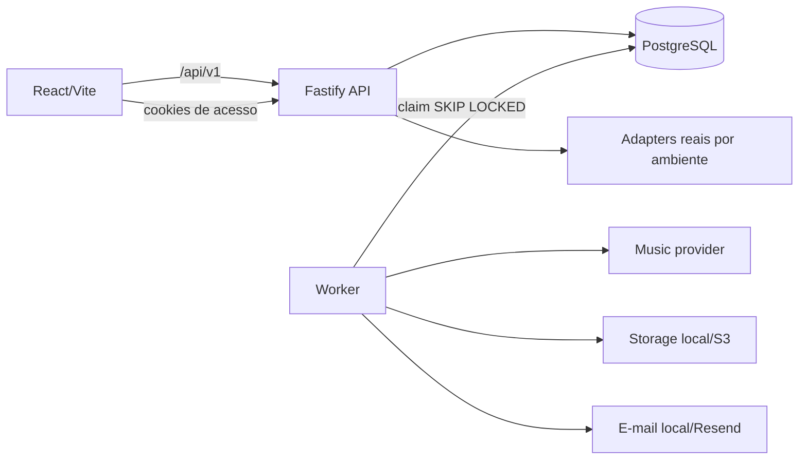

# Arquitetura

O PostgreSQL mantém pedidos, versões de letra, pagamentos, jobs, ativos e eventos. Depois de pagamento confirmado, API e job são criados na mesma transação e a chave de idempotência impede duplicação. O worker reivindica somente um job por vez com lock transacional e recupera jobs abandonados.

Decisões: sem Redis/BullMQ para reduzir serviços; centavos inteiros e UTC; JSONB apenas para formulário e letra validados por Zod; assets privados; token e chave de tentativa guardados somente como hash; capabilities assinadas por pedido. Não há modo fake de provider. Fora de produção, pagamento sem credencial usa confirmação local e e-mail sem credencial vai para `var/emails`; letra e áudio continuam exigindo OpenRouter. Em produção, configurações obrigatórias falham na inicialização.
