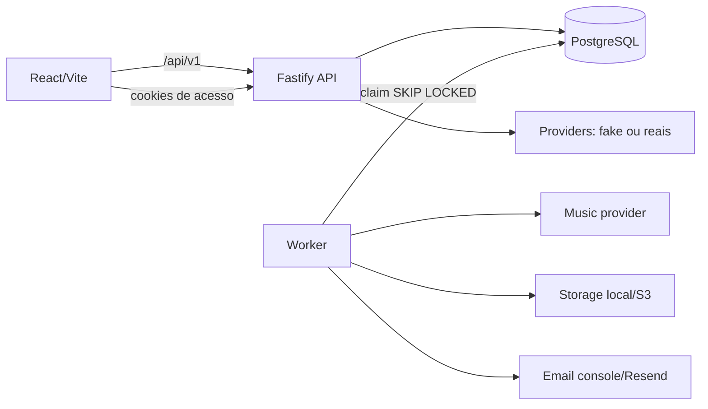

# Arquitetura

O PostgreSQL mantém pedidos, versões de letra, pagamentos, jobs, ativos e eventos. Depois de pagamento confirmado, API e job são criados na mesma transação e a chave de idempotência impede duplicação. O worker reivindica somente um job por vez com lock transacional e recupera jobs abandonados.

Decisões: sem Redis/BullMQ para reduzir serviços; cents/UUIDs; JSONB apenas para a resposta de formulário e estrutura de letra validadas por Zod; assets privados; token de cliente guardado somente como hash; providers fake como padrão local.
