> HISTÓRICO — leitura anterior à remediação de 12/09/2026. Alegações de schema, providers, status e prontidão abaixo podem estar superadas. Este documento não autoriza implementação, gastos ou publicação. Use o [modelo vigente](../../project-context.md) e sua validação.

# Auditoria inicial — MVP operável

Data: 2026-09-04. Escopo: jornada pública de criação, geração, revisão, pagamento, acompanhamento, entrega, erro, retomada e vazio em desktop (1280 × 720) e mobile (390 × 844).

## Veredito

A identidade visual é reconhecível e o caminho nominal existe, mas o MVP ainda não é confiável de ponta a ponta. A navegação preserva a rolagem entre rotas e frequentemente abre a etapa seguinte com título e ação fora da viewport. A geração não apresenta uma retomada clara durante `lyrics_generating`, erros de edição/aprovação podem ficar silenciosos e a falha de produção promete uma ação operacional que a interface não comprova. Na borda HTTP, produtos e checkout ainda expõem UUIDs internos. Os testes existentes passam, mas um E2E aceita um pedido sem `status` como se estivesse em produção.

## Método e limites

As capturas foram produzidas nesta execução com Chromium/Playwright sobre o build atual, usando respostas determinísticas apenas para evitar chamadas pagas a providers. Componentes, navegação, formulários, estados e CSS são os reais. API, domínio e worker foram verificados também por testes com PostgreSQL real; nenhuma chamada externa paga foi feita. Screenshots sustentam hierarquia, conteúdo, responsividade e estados visíveis, mas não provam compatibilidade completa com leitores de tela ou contraste em todos os monitores.

## Passos capturados

1. **Entrada desktop — atenção.** O hero comunica personalização, revisão e duas versões, com CTA inequívoco. O preço mostrado mais abaixo é estático e não está ligado ao catálogo da API.  
   

2. **Formulário vazio desktop — comprometido.** Labels e ordem dos campos são claros, mas o título perde espaços visuais, o indicador diz “Etapa 1 de 6” sem explicar as etapas seguintes e não há resumo persistente do que será enviado.  
   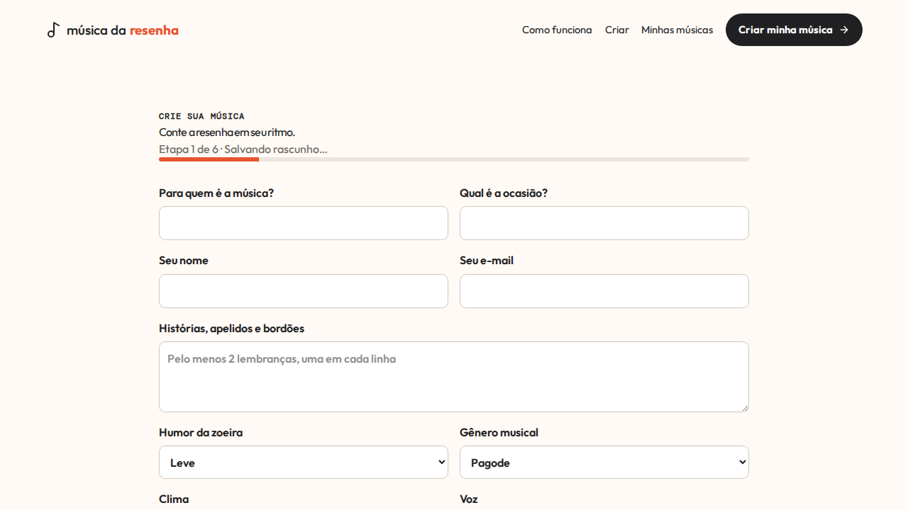

3. **Validação desktop — atenção.** O primeiro campo inválido recebe foco e as mensagens ficam junto aos controles. Os inputs não recebem `aria-invalid`/`aria-describedby`; “conte ao menos uma história” contradiz a regra visível de duas lembranças.  
   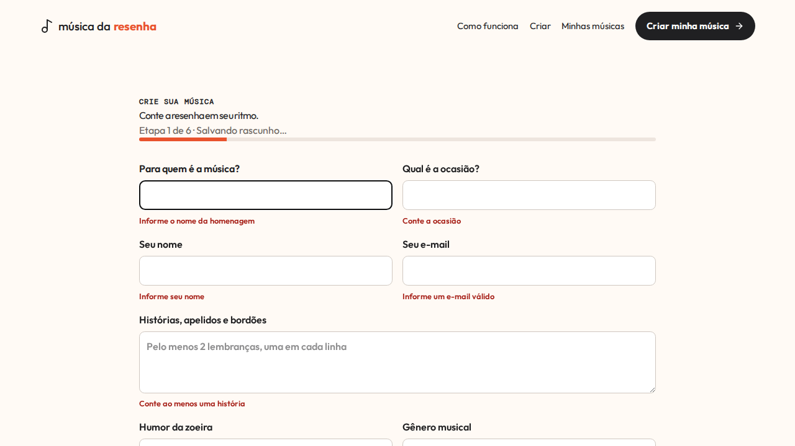

4. **Formulário preenchido desktop — saudável com ressalvas.** O CTA fica claro e o consentimento de marketing é separado. A tipografia muito apertada reduz legibilidade e o feedback de rascunho fica longe da ação ao final da página.  
   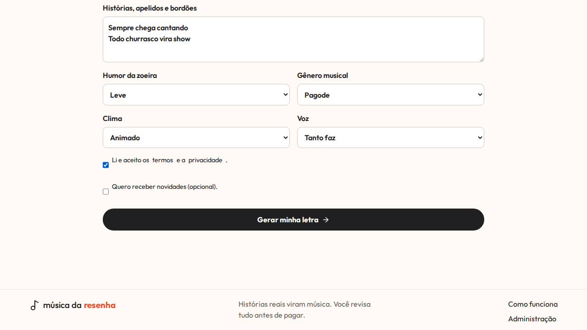

5. **Geração pronta para iniciar — comprometido.** A transição da etapa 1 diretamente para “Etapa 5 de 6” parece perda de progresso. Não há resumo da história, ação para voltar nem explicação sobre tempo/retomada.  
   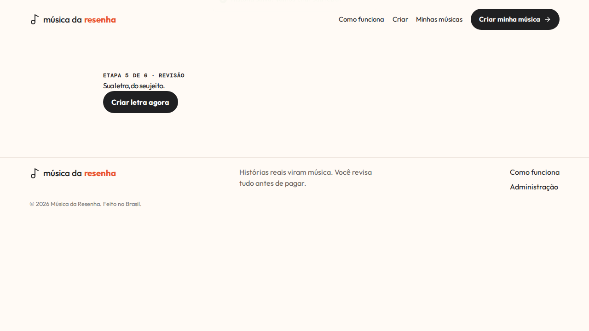

6. **Geração em loading — comprometido.** O botão muda para “Criando…”, mas não há região `aria-live`, progresso persistente, polling visível ou orientação para recarregar. O toast cobre a navegação.  
   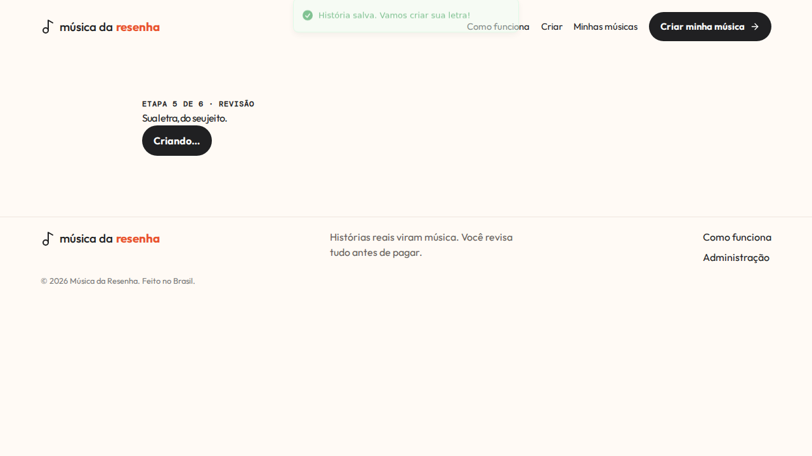

7. **Revisão da letra — comprometido.** A edição é direta e o título da música dá contexto. A área de texto ocupa toda a viewport e deixa “Salvar” e “Aprovar” abaixo da dobra; falhas dessas ações não têm mensagem local garantida.  
   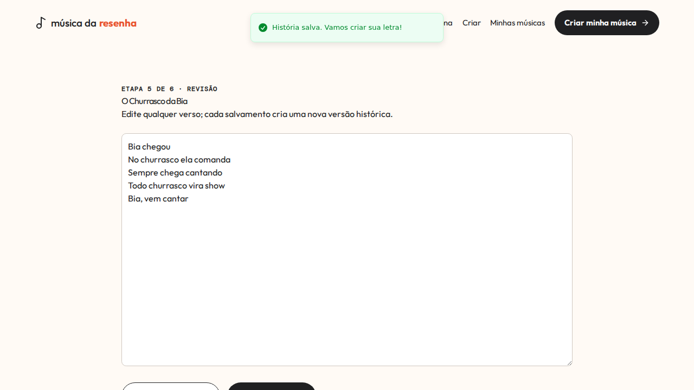

8. **Checkout — atenção.** Preço e conteúdo do pacote são legíveis, mas faltam resumo da letra aprovada, expectativa de prazo e orientação sobre retorno do Mercado Pago. O heading volta a perder espaços visuais.  
   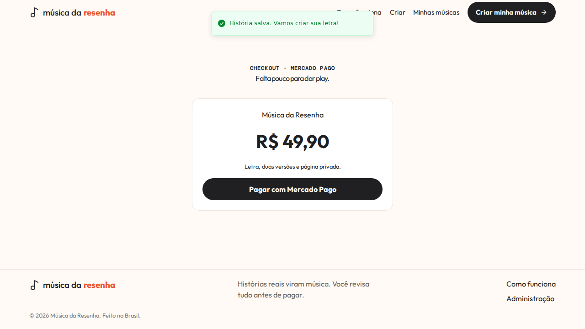

9. **Processamento — bloqueado.** A rota abre mantendo a rolagem da etapa anterior; cabeçalho e título ficam cortados. O progresso não é anunciado como atualização e não há prazo, última atualização ou ação de recuperação.  
   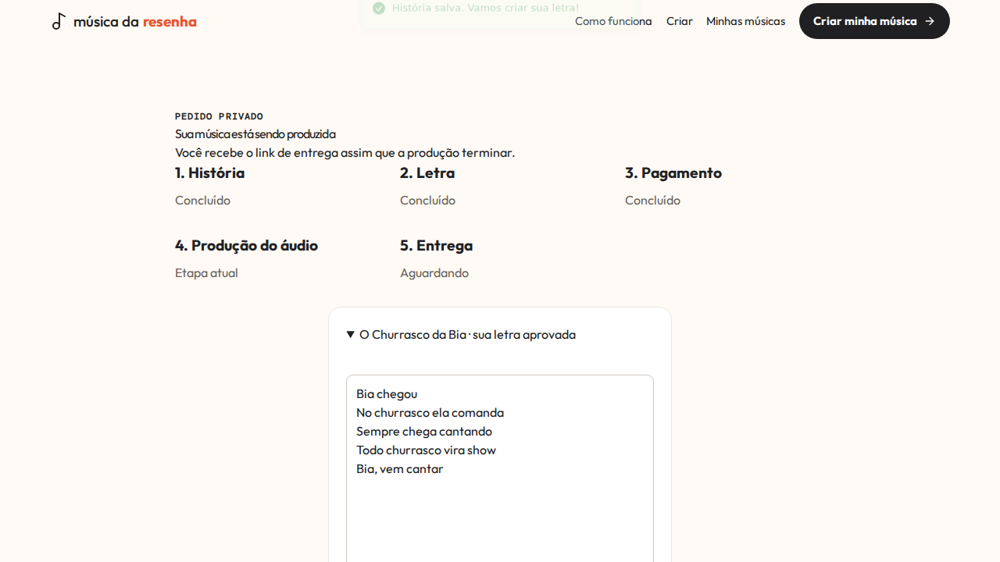

10. **Sucesso — atenção.** O progresso completo e o CTA para ouvir são claros. Os players exigem uma navegação adicional e não há estado visível para falha individual de reprodução/download.  
    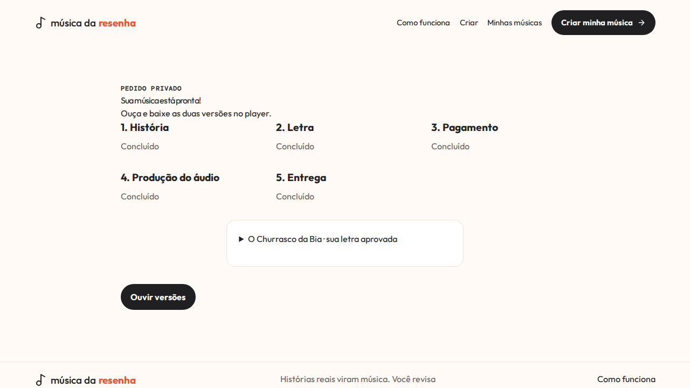

11. **Erro — bloqueado.** O texto e o título ficam visualmente colados. A mensagem afirma que a equipe está revisando e que haverá regeneração sem custo, mas não oferece retry, contato ou evidência de uma ação em curso.  
    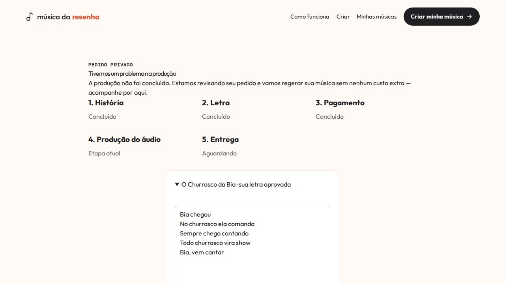

12. **Vazio de “Minhas músicas” — atenção.** Explica corretamente o escopo por navegador e oferece CTA. O heading comprimido compromete a leitura.  
    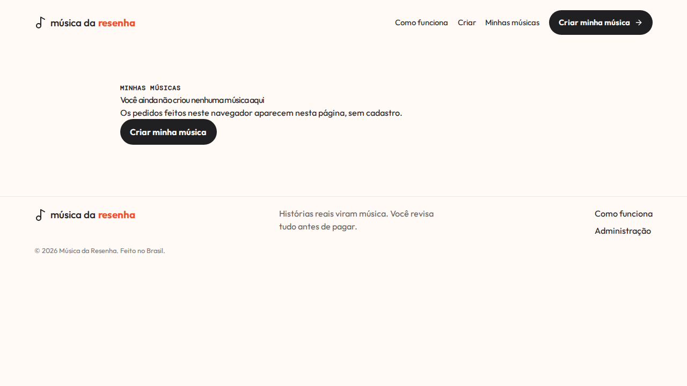

13. **Entrada mobile — saudável com ressalvas.** Hierarquia, CTA e demo cabem na viewport, com boa leitura. A página não indica visualmente que existe conteúdo abaixo da primeira dobra.  
    

14. **Menu mobile — comprometido.** Links e CTA têm alvos grandes, mas o menu não expõe `aria-expanded`, não muda o nome acessível para “Fechar menu”, não bloqueia a rolagem e não demonstra retorno de foco/Escape.  
    

15. **Formulário mobile — comprometido.** Os campos refluem para uma coluna e têm alvos adequados. O título apertado e a falta de contexto/ação persistente tornam o formulário longo e pouco orientado.  
    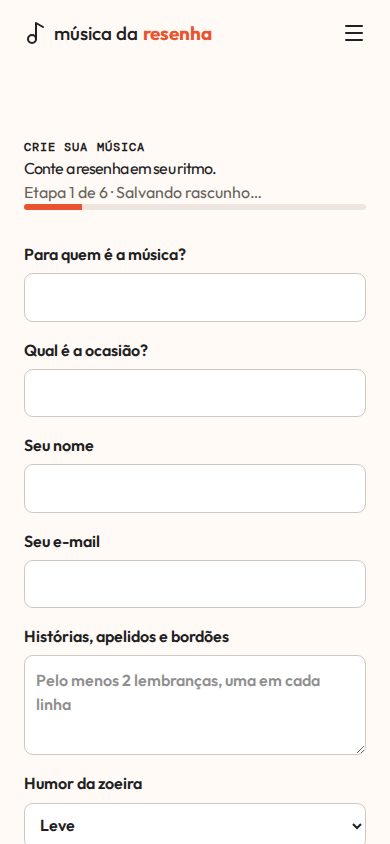

## Diagnóstico priorizado

| ID      | Pri. | Evidência e causa provável                                                                                                           | Impacto / risco                                                                                                | Hipótese e prova esperada                                                                                                                                           |
| ------- | ---- | ------------------------------------------------------------------------------------------------------------------------------------ | -------------------------------------------------------------------------------------------------------------- | ------------------------------------------------------------------------------------------------------------------------------------------------------------------- |
| AUD-001 | P0   | `GET /api/v1/products` devolve a linha Drizzle completa, incluindo UUID interno.                                                     | Viola a fronteira pública e cria precedente de enumeração de dados internos.                                   | Projetar DTO público sem `id`/timestamps; teste de rota deve comparar exatamente as chaves.                                                                         |
| AUD-002 | P0   | Checkout devolve `payments.id`; o endpoint dev recebe esse UUID e não exige o cookie do pedido.                                      | Expõe identidade de persistência e permite acionar uma mutação por referência interna fora de produção.        | Aprovar pagamento dev pelo `publicId` sob cookie do pedido e remover `paymentId` de toda resposta pública; testes devem rejeitar acesso sem cookie.                 |
| AUD-003 | P1   | Capturas 05–09: React Router não restaura scroll no início da rota.                                                                  | A pessoa chega à nova etapa sem título, contexto ou CTA, parecendo uma tela quebrada.                          | Componente global de restauração deve focar o `main` e rolar ao topo em cada pathname; E2E deve provar `scrollY = 0` e foco útil.                                   |
| AUD-004 | P1   | `POST /lyrics/generate` aceita `lyrics_generating` e não faz claim atômico antes da chamada externa.                                 | Dois requests concorrentes podem gerar custo duplicado e versões concorrentes; reload convida a um novo envio. | Claim condicional no banco + janela de recuperação de tentativa abandonada; teste concorrente deve observar uma única chamada ao provider.                          |
| AUD-005 | P1   | Captura 06 e `LyricsReview`: durante geração há apenas botão desabilitado; reload não ativa polling específico.                      | Estado assíncrono e retomada ficam ambíguos; erro pode parecer travamento.                                     | Mostrar status persistente `aria-live`, fazer polling enquanto gera e oferecer retry somente após falha recuperável; E2E cobre reload durante processamento.        |
| AUD-006 | P1   | `CreateStory` cria novo pedido antes de salvar; uma falha de rede no segundo request faz o retry criar outro pedido.                 | Pedidos órfãos/duplicados, histórico confuso e funil inflado.                                                  | Chave idempotente de criação por tentativa, persistida no navegador e única no banco; teste repete o POST e recebe o mesmo `publicId`.                              |
| AUD-007 | P1   | Capturas 02, 08, 09, 11, 12: `letter-spacing: -0.055em` global comprime headings pequenos.                                           | Mensagens centrais perdem legibilidade, sobretudo erro e progresso.                                            | Escala tipográfica específica por página, tracking moderado e line-height explícito; comparação visual nos mesmos viewports.                                        |
| AUD-008 | P1   | Capturas 03, 06 e 14: erros sem relações ARIA, loading sem status robusto e menu sem estado acessível.                               | Teclado e tecnologia assistiva recebem feedback incompleto.                                                    | `aria-invalid`/descrições, status `role=status`, foco visível e menu com expansão/Escape/retorno de foco; testes RTL + teclado E2E.                                 |
| AUD-009 | P1   | E2E “fluxo completo” omite `order.status`; a UI trata `undefined` como produção e o teste passa.                                     | Regressões reais de estado ficam verdes.                                                                       | Fixtures completas validadas e asserções por status observável; remover fallback semântico para estado desconhecido.                                                |
| AUD-010 | P1   | Captura 11: mensagem de falha promete revisão/regeneração sem provar job ativo e não oferece ação adequada à fase.                   | Perde confiança e deixa a pessoa sem saída.                                                                    | Distinguir falha de letra de falha de áudio, dar retry seguro para letra e orientação honesta para áudio; testes por estado.                                        |
| AUD-011 | P1   | Landing fixa `R$ 49,90`, enquanto pedido/checkout usam preço persistido do catálogo.                                                 | Alteração de preço pode produzir promessa comercial divergente.                                                | Consumir DTO público do catálogo e manter fallback textual neutro em erro; teste altera preço e verifica landing/checkout consistentes.                             |
| AUD-012 | P2   | Build alerta chunk inicial de 661 kB; rotas públicas são importadas num único módulo.                                                | Piora carregamento em rede móvel e aumenta tempo até interação.                                                | Separar rotas públicas pesadas/administrativas e medir o build; manter no backlog se não afetar o gate funcional.                                                   |
| AUD-013 | P2   | Documentação ainda menciona “providers fake” e links/nomes históricos em trechos secundários.                                        | Operação local e expectativas de validação podem ser interpretadas incorretamente.                             | Atualizar docs vivas e registrar limites de provider/fallback sem alegar chamada real nesta execução.                                                               |
| AUD-014 | P0   | Cookies `order_<publicId>` e `order_view_<publicId>` usam o valor literal `1`; `hasAccess` confia no valor sem verificar assinatura. | Quem conhece um `publicId` pode forjar o cookie em um cliente HTTP e acessar ou mutar dados privados.          | Assinar e verificar todos os cookies de capability; testes devem provar que `Cookie: order_<publicId>=1` recebe 401 e que cookies emitidos pelo servidor funcionam. |

## Pontos que já funcionam

- Contratos Zod, máquina de estados central, cookie de acesso, ledger de custo e worker retomável já têm cobertura útil.
- Formulário possui autosave local, foco no primeiro erro, labels visíveis, campos nativos e consentimentos separados.
- Checkout usa o preço congelado no pedido, pagamento dev e criação de job no mesmo caminho transacional.
- Histórico local, recuperação por link de entrega, vazio, falha e sucesso têm superfícies próprias.
- Desktop e mobile refluem sem overflow horizontal nas capturas aceitas.

## Backlog inicial

P0/P1 desta tabela entram na especificação `mvp-operavel`. AUD-012 e a revisão integral de documentos históricos ficam como P2, salvo se os gates finais mostrarem impacto maior. Revisão jurídica de termos/privacidade, providers externos reais e deploy permanecem fora desta execução por dependerem de autorização externa.
