> HISTÓRICO — leitura anterior à remediação de 12/09/2026. Alegações de schema, providers, status e prontidão abaixo podem estar superadas. Este documento não autoriza implementação, gastos ou publicação. Use o [modelo vigente](../../project-context.md) e sua validação.

# Auditoria final — MVP operável

Data: 2026-09-04. Escopo: jornada pública, borda HTTP, retomada assíncrona e operação local.

## Veredito

**PASS local.** Todos os P0/P1 da auditoria inicial têm implementação e teste direto. A jornada agora bloqueia estados inválidos, retoma criação e geração sem duplicar efeitos, usa capabilities assinadas e mantém título, ação e progresso visíveis em desktop e mobile. Nenhum provider pago foi chamado e nenhum deploy foi feito nesta validação.

## Comparação visual

As 15 imagens finais repetem os mesmos estados, nomes e viewports do baseline. Cada par foi combinado lado a lado e inspecionado em Chromium antes deste veredito.

| Estado                    | Antes                                                                       | Depois                                                                      | Resultado                                                                      |
| ------------------------- | --------------------------------------------------------------------------- | --------------------------------------------------------------------------- | ------------------------------------------------------------------------------ |
| 01. Entrada desktop       |                              |                              | Identidade preservada; display ganhou espaçamento e hierarquia legíveis.       |
| 02. Formulário vazio      |            | 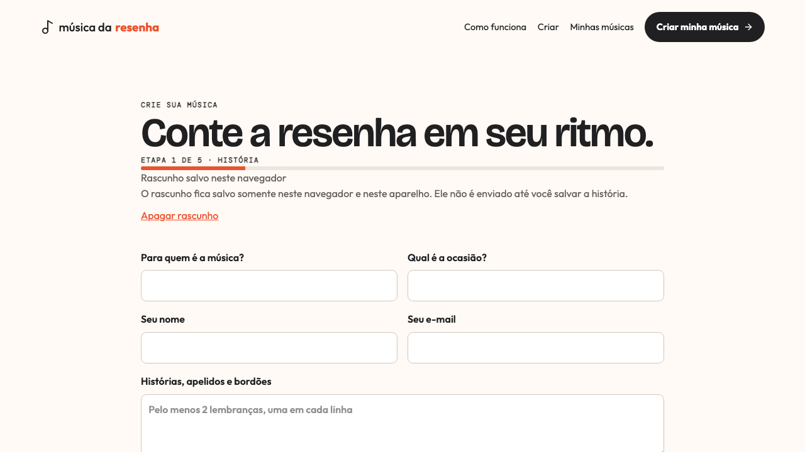           | Título e campos têm separação clara; progresso continua visível.               |
| 03. Validação             |                          | 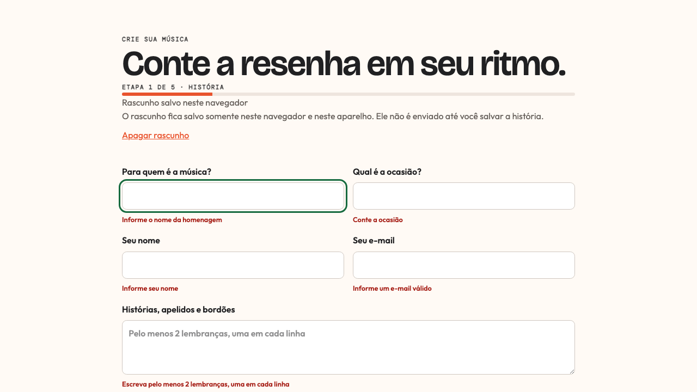                         | Primeiro erro recebe foco visível e cada mensagem descreve seu controle.       |
| 04. Formulário preenchido |  | 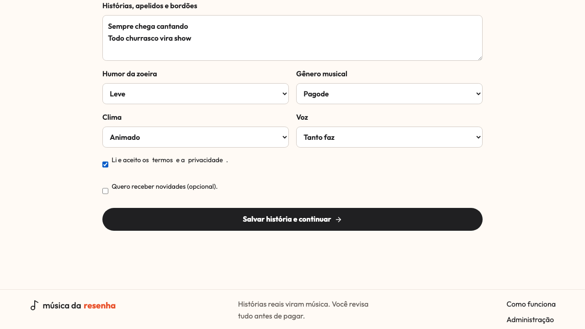 | Conteúdo, consentimentos e CTA permanecem legíveis no fim do formulário.       |
| 05. Pronto para gerar     |   | 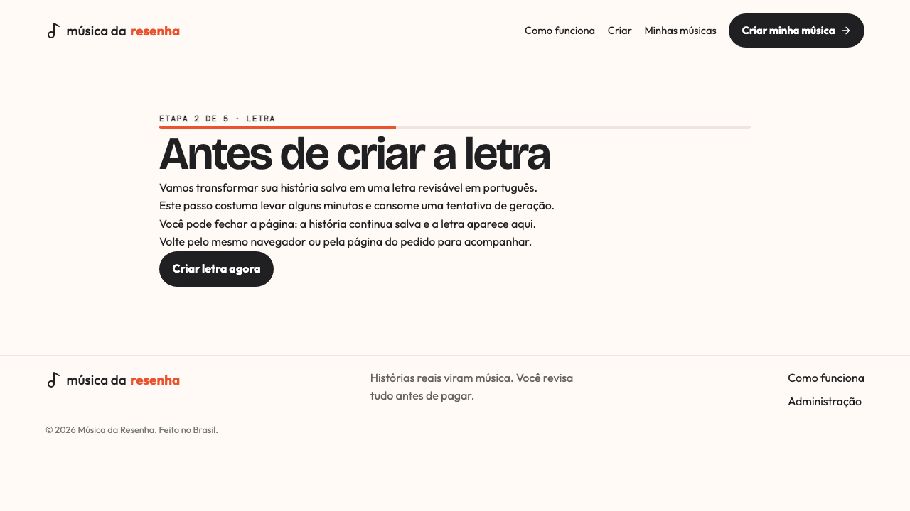  | A etapa agora é 2 de 5, com título e ação inequívocos.                         |
| 06. Geração em andamento  |                      | 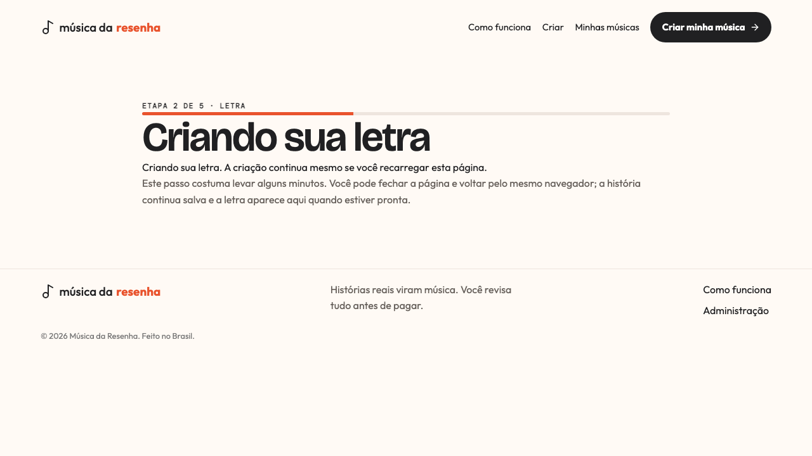                     | Status persistente explica que reload não interrompe nem reinicia a criação.   |
| 07. Revisão da letra      |                        | 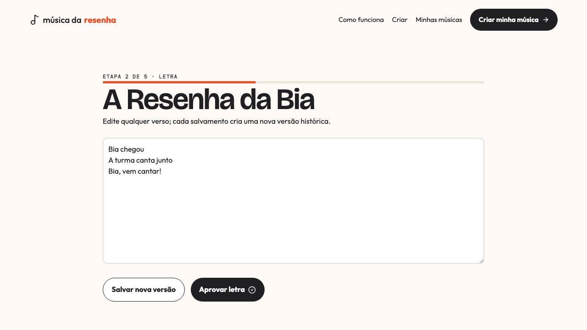                       | Editor preserva espaço de trabalho e os dois CTAs cabem em 1280 × 720.         |
| 08. Checkout              |                            | 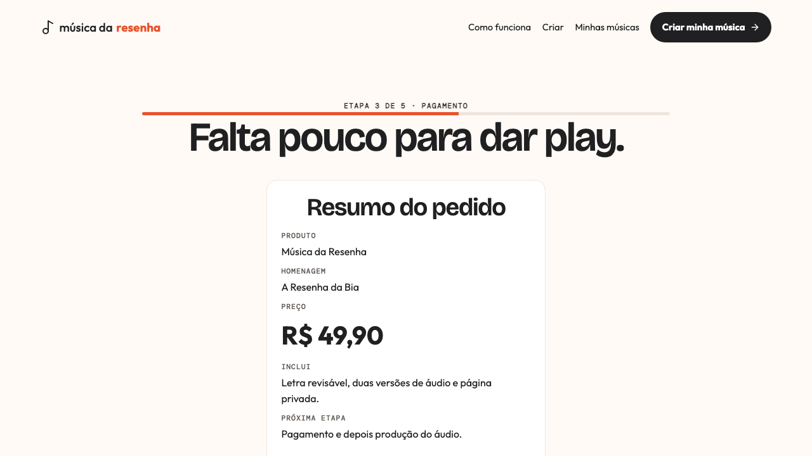                           | Preço, pacote e pagamento formam uma hierarquia única e legível.               |
| 09. Processamento         |                  | 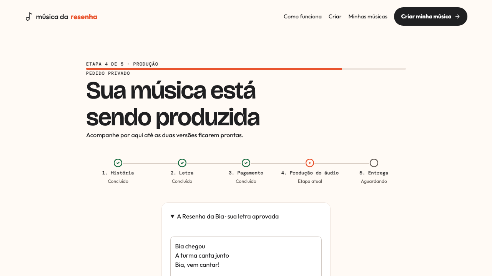                 | Rota abre no topo; título, mensagem e faixa de cinco etapas cabem na viewport. |
| 10. Sucesso               |                              | 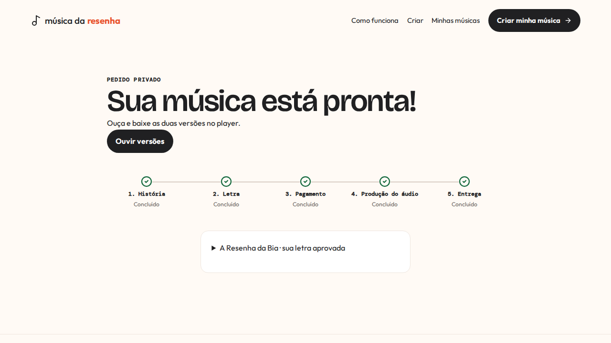                             | Cinco etapas concluídas e CTA para as duas versões ficam juntos.               |
| 11. Erro                  |                                    | 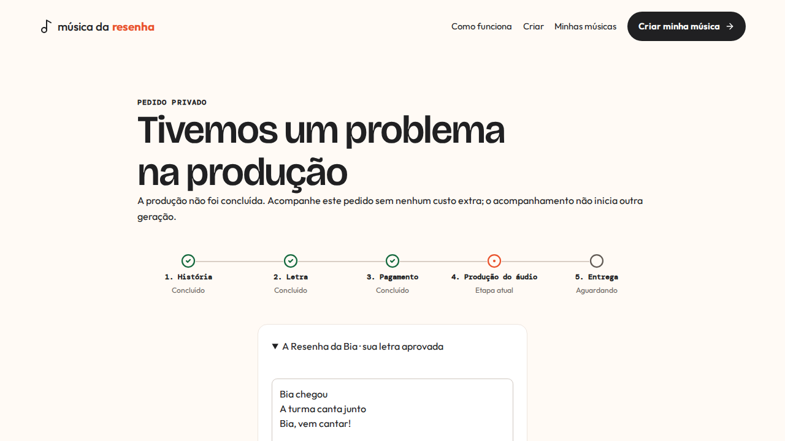                                   | Mensagem não promete nova geração e mantém o acompanhamento honesto.           |
| 12. Histórico vazio       |                                  | 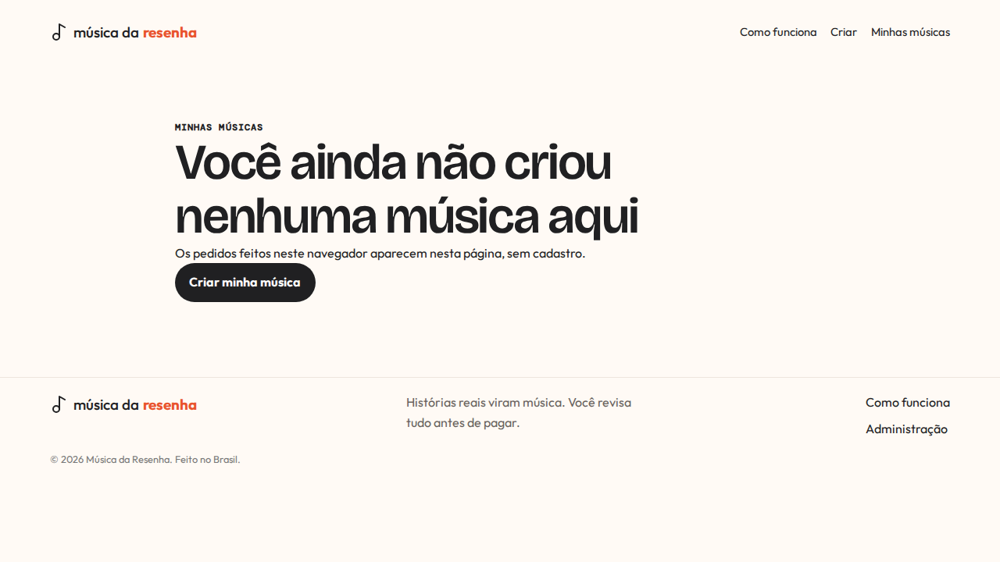                                 | Escopo por navegador e CTA de criação aparecem sem heading comprimido.         |
| 13. Entrada mobile        |                        |                        | Sem overflow ou CTA cortado; alvo primário mede ao menos 44 × 44 px.           |
| 14. Menu mobile           |                                     | 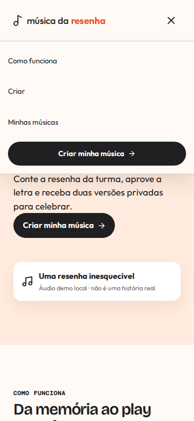                                    | Menu ocupa largura útil, trava scroll e expõe a ação principal.                |
| 15. Formulário mobile     |                  | 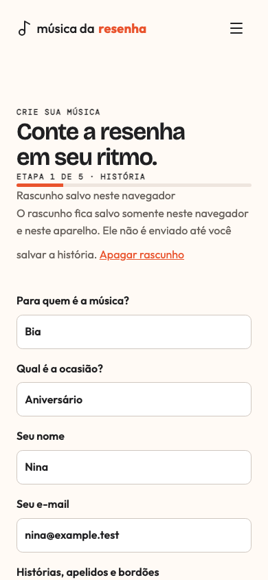                 | Título refluído, campos de uma coluna e texto sem colisão em 390 × 844.        |

## Fechamento dos achados

| ID      | Pri. | Estado  | Evidência de fechamento                                                                                 |
| ------- | ---- | ------- | ------------------------------------------------------------------------------------------------------- |
| AUD-001 | P0   | Fechado | Produtos usam projeção pública estrita e teste rejeita UUID/timestamps.                                 |
| AUD-002 | P0   | Fechado | Checkout omite payment UUID; confirmação dev usa `publicId` e cookie assinado.                          |
| AUD-014 | P0   | Fechado | Cookies de pedido/visualização são assinados; marcador literal recebe 401.                              |
| AUD-003 | P1   | Fechado | `RouteFocus` foca o `main` e rola ao topo em toda mudança de pathname.                                  |
| AUD-004 | P1   | Fechado | Claim condicional permite uma chamada de letra; concorrente recebe 409 e claim velho pode ser retomado. |
| AUD-005 | P1   | Fechado | `lyrics_generating` mostra status vivo e faz polling; reload não envia POST.                            |
| AUD-006 | P1   | Fechado | UUID da tentativa sobrevive à falha parcial; hash único reutiliza pedido/evento.                        |
| AUD-007 | P1   | Fechado | Display usa Bricolage Grotesque, tracking moderado e line-height mínimo de 1.05.                        |
| AUD-008 | P1   | Fechado | Erros e status têm regiões semânticas; menu expõe nome/expansão, Escape e retorno de foco.              |
| AUD-009 | P1   | Fechado | União fechada cobre 15 estados; ausente/futuro vira inconsistência sem CTA de mutação.                  |
| AUD-010 | P1   | Fechado | Falha de letra oferece retry; falha paga orienta acompanhamento sem prometer regeneração automática.    |
| AUD-011 | P1   | Fechado | Landing e checkout usam centavos da API; falha do catálogo não inventa preço.                           |

## Backlog após o fechamento

1. **P2 — chunk público:** o build gera bundle inicial de cerca de 671 kB (192 kB gzip). Admin já é lazy; separar o módulo público pesado fica fora do caminho crítico.
2. **P2 — capa por IA:** [pesquisa e desenho de custo/privacidade](../../album-cover-backlog.md) aprovados para piloto, sem implementação ou chamada paga neste ciclo.
3. **P2 — jurídico/operação externa:** termos, privacidade, sandbox Mercado Pago, Resend, storage privado gerenciado e restore continuam pré-requisitos de produção.
4. **P2 — manutenção React:** React Doctor ficou em 71/100 com três avisos de complexidade e um falso positivo de invalidação após create+navigate; a varredura focada em design retornou zero achados.
5. **P2 — Fastify 6:** migrar `disableRequestLogging` para o novo `logController` antes do upgrade principal.

## Limites da prova

Playwright valida Chromium, teclado, reduced motion e os dois viewports definidos. API e worker usam PostgreSQL real e providers controlados. Compatibilidade com outros browsers, leitor de tela real, chamadas externas e produção não foram declaradas validadas.
