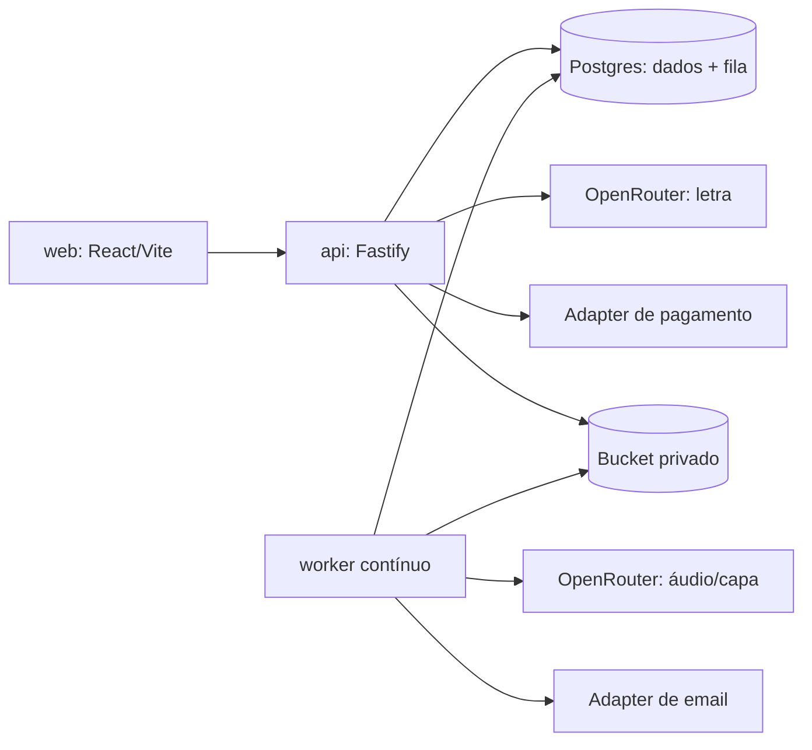

# Contexto canônico do projeto

Este documento é o ponto de entrada para agentes e sessões novas. Evidência operacional corrente fica em `.specs/STATE.md`; especificações e validações por entrega ficam em `.specs/features/`.

## Produto e fluxo

Música da Resenha transforma uma história, homenagem, presente ou ideia livre em letra revisável, pagamento, duas versões de áudio e uma capa opcional. O cliente prepara sua direção criativa em quatro passos internos, sem restringir gênero ou ocasião a uma resenha. A API cria o pedido e gera a letra. O pagamento confirmado cria um job durável no PostgreSQL. O worker gera áudio/capa, persiste arquivos privados e envia o aviso de entrega. A API medeia todo download por capability; o bucket nunca é público.

## Fronteiras reais

| Componente           | Responsabilidade                                                     | Entrada de produção                                                |
| -------------------- | -------------------------------------------------------------------- | ------------------------------------------------------------------ |
| `apps/web`           | Jornada pública e admin; não contém regra de preço/status            | Nginx não-root, porta `8080`, `VITE_API_URL` incorporada no build  |
| `apps/api`           | HTTP, auth/capabilities, letra, checkout/webhook e proxy de arquivos | Fastify, `PORT` ou `API_PORT`, readiness em `/api/v1/health/ready` |
| `apps/worker`        | Polling contínuo, áudio, capa, retry/revisão e e-mail                | Processo sem domínio/cron; restart `ALWAYS`                        |
| `packages/database`  | Drizzle, migrations, seed e fila com `FOR UPDATE SKIP LOCKED`        | `DATABASE_URL` compartilhada por API e worker                      |
| `packages/domain`    | Transições, tokens e prompts compartilhados por API/worker           | Toda mudança de status passa por `assertTransition`                |
| `packages/contracts` | Schemas compartilhados por API/worker                                | A web mantém tipos próprios hoje                                   |
| `packages/providers` | Adapters de storage e email                                          | Produção exige S3 compatível privado                               |

OpenRouter e transporte AbacatePay da API vivem em `apps/api/src/providers.ts`; seleção de pagamento em `apps/api/src/payment.ts`. OpenRouter de áudio/capa permanece no worker. E-mail foi extraído para `packages/providers/src/email.ts`; intenção persistida e retry pertencem ao worker. Configuração pública sanitizada fica em `apps/api/src/configuration.ts`.

## Topologia Railway decidida

O projeto Railway privado `musica-da-resenha` e os serviços vazios `web`, `api` e `worker` já existem. Eles ainda não têm source, variáveis, domínio ou deployment. `Postgres` e `Bucket` ainda não foram criados porque seu provisionamento inicia infraestrutura/deploy e permanece atrás de autorização explícita. Esse estado foi reconfirmado em leitura ao vivo em 2026-09-07: nenhum deployment nos três serviços e nenhum Postgres/Bucket. Revalide antes de qualquer ação futura.

A topologia alvo usa o ambiente inicial `production` sem tráfego comercial, com `web`, `api`, `worker`, `Postgres` e `Bucket`. Os três apps usam o mesmo repositório `gustavospriebe/music`, branch `main`, e contexto de build na raiz porque compartilham workspaces. API e worker usam o mesmo banco e bucket. Somente web e API recebem domínio público.

O Bucket Railway é S3 compatível, privado e criptografado em repouso. Ele não oferece backup automático, versionamento, lifecycle nem object lock. Objetos precisam de export/backup externo. O tráfego serviço→bucket usa rede pública e conta como egress do serviço.

## Gates e estados

- `pnpm check`: format, lint, typecheck, testes e build locais.
- `pnpm test:e2e`: Playwright separado; requer aplicação/banco preparados.
- CI remoto: PostgreSQL 16, migrations no banco principal e de teste, suítes serializadas no banco compartilhado, demais gates e Playwright.
- Provider real, Browser UAT, homologação, deploy e produção são gates distintos. Nunca derive um do outro.

O CI remoto importado falhava antes do install porque `actions/setup-node` tentava localizar pnpm para o cache antes da instalação. O workflow corrigido instala pnpm primeiro com `pnpm/action-setup`, declara no Turbo as variáveis de teste permitidas e serializa as suítes que truncam o mesmo banco. A correção passou localmente, mas ainda não foi publicada nem observada em uma execução remota.

O contrato local atual é Node 22 + pnpm 12.3.4. O `pnpm-lock.yaml` tem dois documentos oficiais do pnpm 12 (ambiente e grafo do projeto), fica fora do Prettier e passou em instalação congelada byte-estável. A baseline de 2026-09-06 passou migrations/seed, 119 testes, build, 30 E2E e imagens Docker de web/API/worker sem chamadas externas. Consulte `.specs/features/local-readiness-ui-audit/local-validation.md`.

A auditoria anterior de cliente e administração está em `docs/ui-ux-audit.md`. Ela preserva a direção visual existente e prioriza arquitetura da jornada, confiança comercial, cockpit operacional, privacidade e acessibilidade antes do redesign. A remodelagem que a implementa está entregue em `docs/ui-remodel-report.md` (spec/design/tasks/validação em `.specs/features/ui-remodel/`): jornada única de cinco etapas, checkout com resumo e estado do provider, cockpit admin com agregados do servidor e PII mascarada, menu mobile com foco contido. Texto jurídico/comercial segue pendente e o lançamento comercial segue bloqueado.

## Restrições de operação

- Não registrar secrets, tokens, payloads pessoais nem IDs internos em logs ou docs.
- Não executar provider pago sem autorização e teto de custo.
- Não criar Redis/fila paralela: PostgreSQL já é a fila durável.
- Não usar disco efêmero em produção. `STORAGE_PROVIDER=s3` é obrigatório.
- Migration é repetível; seed inicial é necessário para popular produtos. Nunca usar seed como migration recorrente sem conferir seu efeito.
- `AUDIO_REVIEW_MODE=manual` é o default seguro de ativação até decisão comercial explícita.

## Próximos documentos

- Infra: `docs/railway-setup.md`
- Providers e segredos: `docs/provider-setup.md`
- Ativação externa: `docs/external-activation-runbook.md`
- Checklist de promoção: `docs/production-checklist.md`
- Auditoria UI/UX atual: `docs/ui-ux-audit.md`
- Baseline local: `.specs/features/local-readiness-ui-audit/local-validation.md`
- Estado atual e decisões: `.specs/STATE.md`

## Entrega atual: launch-remodel

A revisão geral e remodelagem de 2026-09-07 estão em `.specs/features/launch-remodel/` e `docs/launch-remodel-report.md`. O produto custom_song amplia criação sem reescrever produtos antigos. Preço inicial0 significa pendente, não gratuito; seed preserva catálogo já precificado e pedidos mantêm snapshot. Condições comerciais e preço positivo bloqueiam checkout real enquanto não definidos. Gateway pode permanecer disabled.

Acesso assinado vincula tipo, pedido e versão corrente; revogação invalida cookies e links antigos. Revisão pós-entrega é visível ao admin. Intenção de email e link permanecem estáveis no retry, sem token aberto no banco. Logs locais foram removidos do worktree com backup; nenhum histórico remoto foi reescrito.

Preview local isolado: `bash scripts/local-preview.sh api|web|worker`, web5180/API3010, banco music_launch_preview. O script neutraliza chaves por padrão e admite opt-in seletivo `PREVIEW_AI=lyrics|lyrics-audio|all`, depois de autorização com orçamento; `all` inclui capas. O worker com IA roda sem watch para que alterações de código não reiniciem uma chamada paga em andamento. Runtime e gates usam Node22. Não houve commit, push ou deploy.

## Correções após UAT humana

As observações do usuário sobre intenção/ocasião, controles duplicados e jornada foram tratadas em `.specs/features/studio-flow-uat-fixes/` e `docs/studio-flow-uat-fixes.md`. A segunda rodada amplia edição/refinamento da letra, condições comerciais e atividade de produção em `.specs/features/lyrics-production-polish/`. Consulte essas evidências e STATE antes de considerar a experiência concluída.

O usuário autorizou chamadas reais até US$3 nesta rodada de 2026-09-07. Um pedido fictício produziu letra, duas versões de áudio e capa com sucesso. Outro pedido encontrou primeiro HTTP402 por limite específico da chave, embora a conta tivesse saldo; o usuário removeu esse limite. Na retomada, o filtro do modelo recusou duas tentativas e o job encerrou. Esses resultados comprovam chamadas específicas, não disponibilidade irrestrita nem aceite artístico. Erros permanentes de áudio não geram retries automáticos; uma retomada administrativa explícita preserva o contador histórico e libera pelo menos mais uma tentativa.
